# CDE Hands-on-Lab CEMEA

- [CDE Hands-on-Lab CEMEA](#cde-hands-on-lab-cemea)
  - [Objective](#objective)
  - [Prerequisites](#prerequisites)
- [Step by Step Instructions](#step-by-step-instructions)
  - [Lab 0. Project Setup](#lab-0-project-setup)
      - [0.1 Edit the parameters.conf](#01-edit-the-parametersconf)
      - [0.2 Notes on Naming Conventions](#02-notes-on-naming-conventions)
      - [0.3 Notes on CDE Virtual Clusters](#03-notes-on-cde-virtual-clusters)
  - [Lab 1: Manage Spark Jobs with CDE](#lab-1-manage-spark-jobs-with-cde)
      - [Summary](#summary)
      - [1.1 Creating File Resources](#11-creating-file-resources)
      - [1.2 Creating Python Resources](#12-creating-python-resources)
      - [1.3 Create and Run Your First CDE Spark Job](#13-create-and-run-your-first-cde-spark-job)
      - [1.4 Monitor Your First CDE Spark Job](#14-monitor-your-first-cde-spark-job)
      - [1.5 Additional Spark Jobs](#15-additional-spark-jobs)
  - [Lab 2: Orchestrate Data Pipelines with Airflow](#lab-2-orchestrate-data-pipelines-with-airflow)
      - [Summary](#summary-1)
      - [Airflow Concepts](#airflow-concepts)
      - [2.1 No-Code Approach to Defining Airflow Jobs](#21-no-code-approach-to-defining-airflow-jobs)
      - [2.2 Airflow Connections](#22-airflow-connections)
      - [2.3 Python Approach to defining Airlow Job](#23-python-approach-to-defining-airlow-job)
  - [Lab 3: Explore Iceberg in Interactive Sessions](#lab-3-explore-iceberg-in-interactive-sessions)
      - [Summary](#summary-2)
      - [3.1 Start an Interactive Session with Iceberg](#31-start-an-interactive-session-with-iceberg)
      - [3.2 Confirm the Data Quality Issues](#32-confirm-the-data-quality-issues)
      - [3.3 Identify the correct Snapshot and Revert the Table](#33-identify-the-correct-snapshot-and-revert-the-table)
  - [Lab 4: Automate CDE Workflows with the CDE CLI](#lab-4-automate-cde-workflows-with-the-cde-cli)
      - [Summary](#summary-3)
      - [4.1 Install and Configure the CDE CLI](#41-install-and-configure-the-cde-cli)
      - [4.2 Run an Application using the CDE CLI](#42-run-an-application-using-the-cde-cli)
  - [Bonus Lab 1: Visualize Job \& Data Lineage in Atlas](#bonus-lab-1-visualize-job--data-lineage-in-atlas)
      - [Summary](#summary-4)
- [Next Steps](#next-steps)

## Objective

CDE is the Cloudera Data Engineering Service, a serverless containerized managed service for Cloudera Data Platform designed for Large Scale Batch Pipelines with Spark, Airflow and Iceberg. It allows you to submit batch jobs to auto-scaling virtual clusters. As a serverless service, CDE enables you to spend more time on your applications, and less time on infrastructure.

CDE allows you to create, manage, and schedule Apache Spark jobs without the overhead of creating and maintaining Spark clusters. With CDE, you define virtual clusters with a range of CPU and memory resources, and the cluster scales up and down as needed to run your Spark workloads, helping to control your cloud costs.

This Hands-on-Lab is designed to walk you through the Service's main capabilities. Throughout the exercises you will:

1. [Deploy, configure, execute and monitor Spark Jobs](#lab-1-manage-spark-jobs-with-cde).
2. [Orchestrate pipelines with Airflow](#lab-2-orchestrate-data-pipelines-with-airflow).
3. [Use Iceberg to address data quality issues in a CDE Interactive Session](#lab-3-explore-iceberg-in-interactive-sessions).
4. [Use the CDE CLI to automate CDE workflows](#lab-4-automate-cde-workflows-with-the-cde-cli).

Throughout these labs, you are going to deploy an ELT (Extract, Load, Transform) data pipeline that extracts data stored on AWS S3 object storage, loads it into the Cloudera Data Lakehouse and transforms it for reporting purposes.

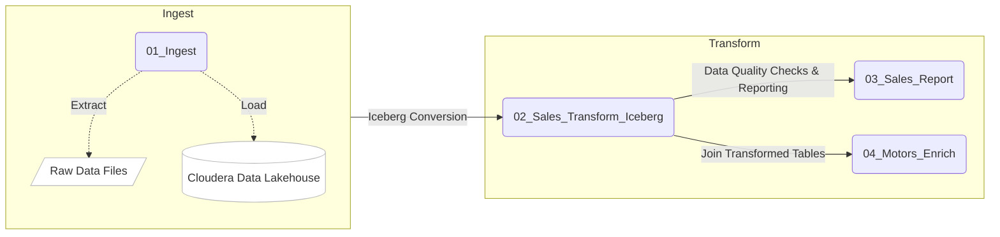

The Sales_Report job will give us an aggregate overview of our sales by model and customer types:

```
GROUP TOTAL SALES BY MODEL
+-------+--------------------+
|  Model|total_sales_by_model|
+-------+--------------------+
|Model C|        136557721.36|
|Model D|        162208438.10|
|Model R|        201420946.00|
+-------+--------------------+

GROUP TOTAL SALES BY GENDER
+------+---------------------+
|Gender|total_sales_by_gender|
+------+---------------------+
|     F|         258522496.93|
|     M|         241664608.53|
+------+---------------------+
````

## Prerequisites

Before you can run this Hands-on-Lab you need:
* Familiarity with Python and PySpark is highly recommended.
* A CDP environment with an enabled CDE service (Azure, AWS or Private Cloud).
* A CDE Virtual Cluster with Spark 3 and Iceberg enabled. 
* Sample data uploaded to the AWS S3 Bucket with read access from CDE.
* [Bonus Lab 1](#...) requires a Hive CDW Virtual Warehouse. This lab is optional.

# Step by Step Instructions

## Lab 0. Project Setup

Clone this GitHub repository to your local machine or the VM where you will be running the script.

```
mkdir <your-directory>
cd <your-directory>
git clone https://github.com/cloudera-cemea/CDE_vHoL.git
```

Alternatively, if you don't have `git` installed on your machine, create a folder on your local computer; navigate to [this URL](https://github.com/cloudera-cemea/CDE_vHoL.git) and manually download the files.

#### 0.1 Edit the parameters.conf

Before you start the labs, open the [parameters.conf](./resources_files/parameters.conf) file in the "resource_files" directory and edit both fields with your assigned username and the AWS S3 Bucket provided by your Cloudera Workshop Lead. If you are reproducing these labs on your own you will also have to ensure that these values reflect the Cloud Storage path where you loaded the data.

```
[general]
s3BucketName: s3a://cdp-data-lake/workshop-bucket   <-- replace this with the bucket provided to you
username: user123                                   <-- replace this with the username assigned to you
```

#### 0.2 Notes on Naming Conventions

Throughout the workshop you will be asked to name CDE objects such as Resources, Jobs and Connections. Make sure to **prefix these names with your unique username** provided to you by your Cloudera Workshop Lead.

These sections are marked with **⚠ Warning** in the instructions. Whenever you see naming examples in this document using **user123**, simply replace that with your username.

#### 0.3 Notes on CDE Virtual Clusters

You will be assigned to a specific CDE Virtual Cluster by your Cloudera Workshop Lead. Please make sure that you select your assigned Virtual Cluster whenever you are creating or browsing CDE Jobs and Resources.

## Lab 1: Manage Spark Jobs with CDE

#### Summary

In this section you will create, configure and execute Spark jobs manually via the CDE UI. You will manage application files and Python Virtual Environments with CDE Resources. CDE Resources can be of type "File", "Python", or "Custom Runtime". You will start by creating a File Resource to manage your application code (Spark and Airflow files) and dependencies. Then you will create a "Python Resource" to utilize custom Python libraries in a CDE Spark Job run.

To get started, navigate to the CDE Service from the CDP Home Page by clicking on the blue "Data Engineering" icon.


#### 1.1 Creating File Resources

To create a File Resource, from the CDE Home Page click on "Create New" in the "Resources" ->"File" section.


Pick your assigned CDE Virtual Cluster and name your Resource after your username or a unique ID.

>**⚠ Warning**
>Name your File Resource with your username assigned to you by your Cloudera Workshop Lead, e.g. "user123-cde-hol-files"

Upload all files from the "./cde_spark_jobs" folder. Then, navigate back to the Resources tab and upload the "utils.py" file as well as the "parameters.conf" file contained in the "./resources_files" folder.

When you are done, ensure that the following files are located in your File Resource:

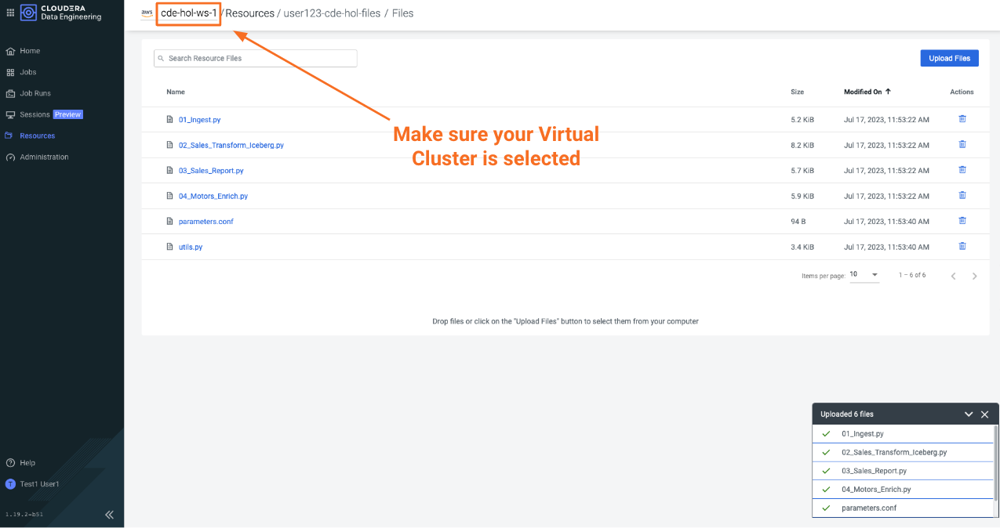

#### 1.2 Creating Python Resources

In the next step you will create a Resource of type "Python". Python Resources allow you to manage Python Virtual Environments that you can use across different CDE Jobs.

Navigate back to the CDE Home Page and click on "Create New" in the "Resources" -> "Python" section.

Ensure to select the same CDE Virtual Cluster. Name the Python CDE Resource again after your unique user and leave the PyPI mirror field blank.

>**⚠ Warning**
>Name your Python Resource with your username assigned to you by your Cloudera Workshop Lead, e.g. "user123-cde-hol-python"

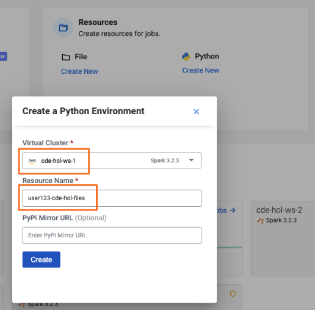

Upload the "requirements.txt" file provided in the "./resources_files" folder.


Notice the CDE Resource is now building the Python Virtual Environment. After a few moments the build will complete and you will be able to validate the libraries used.


To learn more about CDE Resources please visit [Using CDE Resources](https://docs.cloudera.com/data-engineering/cloud/use-resources/topics/cde-python-virtual-env.html) in the CDE Documentation.

#### 1.3 Create and Run Your First CDE Spark Job

With the resources in place, we will create our first Spark Job based on the "01_Ingest.py" application file.

>**⚠ Warning**
>Name your CDE Jobs with your username assigned to you by your Cloudera Workshop Lead, e.g. "user123-01_Ingest"

Navigate back to the CDE Home Page. Click on "Create New" in the "Jobs" -> "Spark" section.


Select your CDE Virtual Cluster and assign your unique Job Name with your username, e.g. "user123-01_Ingest". Scroll down; ensure to select "File" from the radio button and click on "Select from Resource" in the "Application File" section. A window will open with the contents loaded in your File Resource. Select script "01_Ingest.py".

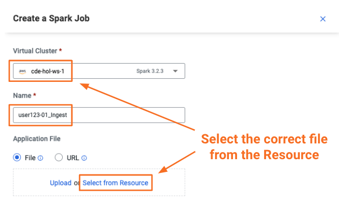

Scroll down again and toggle the "Advanced" section. Here, under the "Resources" section you can notice that your File Resource has been mapped to the Job by default. This allows the PySpark script to load files such as "parameters.conf" and simple Python modules such as the "utils.py" that you uploaded earlier.


The scripts you are using in this workshop make use of these file resources like the "01_Ingest.py" shown below:

```python
...
config = configparser.ConfigParser()
config.read("/app/mount/parameters.conf")
s3BucketName=config.get("general","s3BucketName")
username=config.get("general","username")
...
```

Scroll to the bottom and click on the "Create and Run" blue icon.


#### 1.4 Monitor Your First CDE Spark Job

You will be automatically taken to the Jobs tab where the Job will now be listed at the top. Open the Job Runs tab on the left pane and validate that the CDE Spark Job is executing.

When complete, a green checkmark will appear on the left side. Click on the Job Run number to explore further.

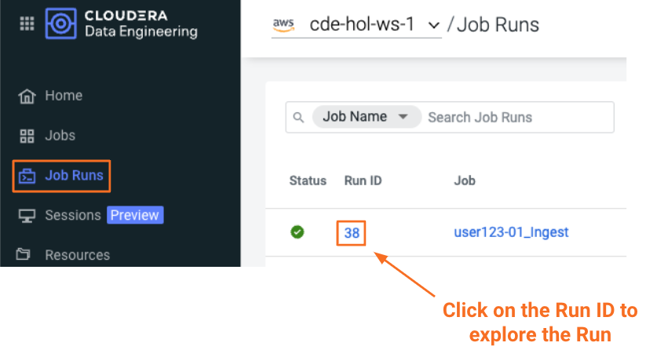

The Job Run is populated with Metadata, Logs, and the Spark UI. This information is persisted and can be referenced at a later point in time.

- The Configuration tab allows you to verify the script and resources used by the CDE Spark Job.
- The Logs tab contains rich logging information. For example, you can verify your code output under "Logs" -> "Driver" -> "stdout".
- The Spark UI allows you to visualize resources, optimize performance and troubleshoot your Spark Jobs.


#### 1.5 Additional Spark Jobs

Now that you have learned how to create Spark Jobs you can create the remaining Spark Jobs based on the application files "02_Sales_Transform_Iceberg.py", "03_Sales_Report.py" and "04_Motors_Enrich.py", as well as the previously created Python Resource. Create CDE Spark Jobs with the settings below leaving all other options to their default. Allow each job to complete before creating and executing a new one.

>**⚠ Warning**
>Always make sure to select the correct file resource starting with your username, e.g. "user123-cde-hol-files".

>**⚠ Warning**
>Name your CDE Jobs with your username assigned to you by your Cloudera Workshop Lead, e.g. "user123-02_Sales_Transform_Iceberg"

Create the jobs with the following configurations:

```
Job Name: user123-02_Sales_Transform_Iceberg
Type: Spark
Application File: 02_Sales_Transform_Iceberg.py
Resource(s): user123-cde-hol-files

Job Name: user123-03_Sales_Report
Type: Spark
Python Environment: user123-cde-hol-python       <-- note this job runs functions from the utils.py module that rely on the custom Python Environment
Application File: 03_Sales_Report.py
Resource(s): user123-cde-hol-files

Job Name: user123-04_Motors_Enrich
Type: Spark
Application File: 04_Motors_Enrich.py
Resource(s): user123-cde-hol-files
```

Note that the ["03_Sales_Report.py"](./cde_spark_jobs/03_Sales_Report.py) script references the ["utils.py"](./resources_files/utils.py) module that we uploaded earlier to run data quality checks using the [quinn library](https://github.com/MrPowers/quinn) as shown below.

```python
import quinn
...
def test_column_presence(spark_df, col_list):
    print("Testing for existence of Columns: ", [i for i in col_list])

    try:
        print(quinn.validate_presence_of_columns(spark_df, col_list))
...
```

In order for Spark to use third-party Python libraries like we can leverage the Python Resource created earlier. Simply select your Python Resource when creating the Spark Job.

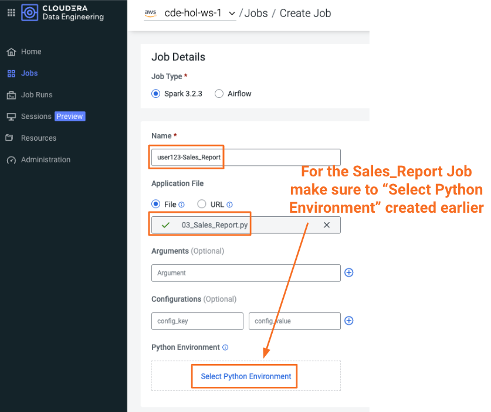

Verify that all jobs have executed successfully, then try to retrieve the logs from your Sales_Report job.

Verify that the Data Quality checks have been successful and you are seeing the following report:

```
GROUP TOTAL SALES BY MODEL
+-------+--------------------+
|  Model|total_sales_by_model|
+-------+--------------------+
|Model C|        135844649.26|
|Model D|        161544309.59|
|Model R|        201184507.04|
+-------+--------------------+

GROUP TOTAL SALES BY GENDER
+------+---------------------+
|Gender|total_sales_by_gender|
+------+---------------------+
|     F|         257638222.62|
|     M|         240935243.27|
+------+---------------------+
```

>**Note**
>The Iceberg Jars did not have to be loaded in the Spark Configurations. Iceberg is enabled at the Virtual Cluster level.

>**Note**
>Job 03_Sales_Report uses the Quinn Python library. The methods are implemented in utils.py which is loaded via the File Resource.   

To learn more about Iceberg in CDE please visit [Using Apache Iceberg in Cloudera Data Engineering](https://docs.cloudera.com/data-engineering/cloud/manage-jobs/topics/cde-using-iceberg.html).

To learn more about CDE Jobs please visit [Creating and Managing CDE Jobs](https://docs.cloudera.com/data-engineering/cloud/manage-jobs/topics/cde-create-job.html) in the CDE Documentation.

## Lab 2: Orchestrate Data Pipelines with Airflow

#### Summary

You have now created and executed Spark Jobs manually. In this section, you will learn how to create Airflow jobs to schedule, orchestrate and monitor the execution of Spark Jobs on CDE.

You will also learn about:
- Navigating the Airflow UI
- Code and No-Code approaches to defining Airflow Jobs
- Airflow Key Concepts including DAGs, Operators, Connections

#### Airflow Concepts

You may have noticed that the jobs created in the previous section naturally come with dependencies. Some jobs such as 01_Ingest have to run before others can be started, Some other jobs such as 04_Motors_Enrich and 02_Sales_Transform_Iceberg are independent of each other. In data pipelines, these dependencies are typically expressed in the form of a DAG (Directed Acyclic Graph). Airflow leverages this concept and lets you define your DAGs as code in Python.

On top of that, Airflow enables you to define important parameters such as schedule, retries, timeouts, Email notifications and much more at both DAG and individual task levels.

For more information about Airflow DAGs, see Apache Airflow documentation [here](https://airflow.apache.org/docs/apache-airflow/stable/concepts/dags.html). For an example DAG in CDE, see CDE Airflow DAG documentation [here](https://docs.cloudera.com/data-engineering/cloud/orchestrate-workflows/topics/cde-airflow-editor.html).

The Airflow UI makes it easy to monitor and troubleshoot your data pipelines. For a complete overview of the Airflow UI, see  Apache Airflow UI documentation [here](https://airflow.apache.org/docs/apache-airflow/stable/ui.html).

#### 2.1 No-Code Approach to Defining Airflow Jobs

You can use the CDE Airflow Editor to build DAGs without writing code. This is a great option if your DAG consists of a long sequence of CDE Spark or CDW Hive jobs. In this section you will create the following pipeline to orchestrate your previously created CDE Spark Jobs:

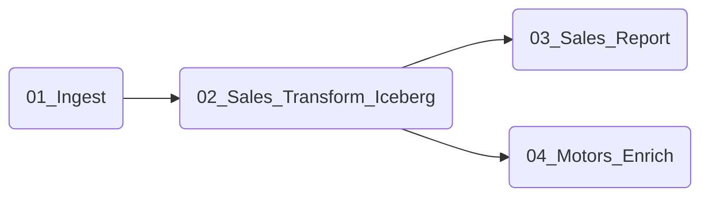

To create the pipeline, first navigate to the "Administration" tab. From  there, click on the "View Jobs" icon for your Virtual Cluster. A new Browser tab for your Virtual Cluster will open.

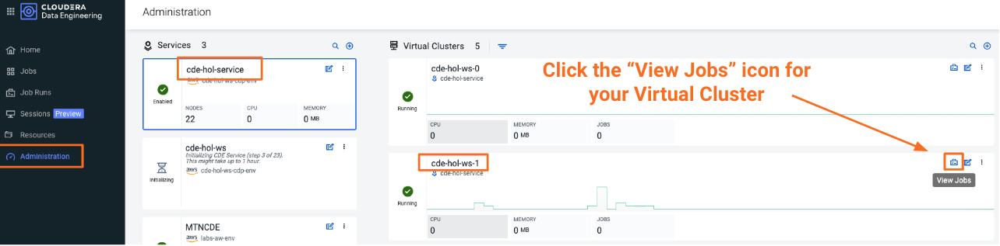

In this new view, create a new CDE Job of type "Airflow" as shown below. Ensure to select the "Editor" option. Then click create.

>**⚠ Warning**
>Name your CDE Airflow Jobs with your username assigned to you by your Cloudera Workshop Lead, e.g. "user123-Spark-DAG"

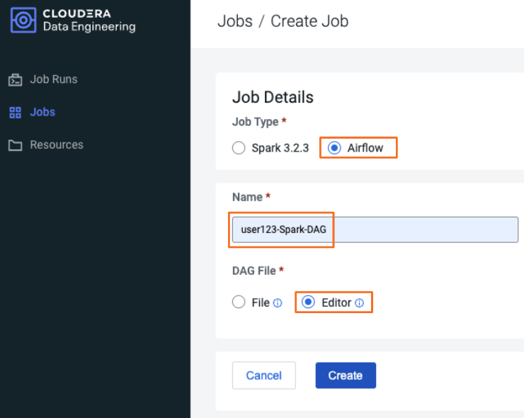

From the Editor Canvas drag and drop a CDE Job. Click on the icon on the canvas and an option window will appear on the right side. Enter the name of the CDE Job you want to schedule. For the first job, select the 01_Ingest job for your user. Repeat the process for the remaining CDE Jobs 04_Motors_Enrich, 02_Sales_Transform_Iceberg and 03_Sales_Report. To define the dependencies simply connect the CDE Jobs with your mouse.

>**Warning**
>Make sure to reference the correct CDE Spark Jobs starting with your username to avoid running jobs from other workshop participants. 

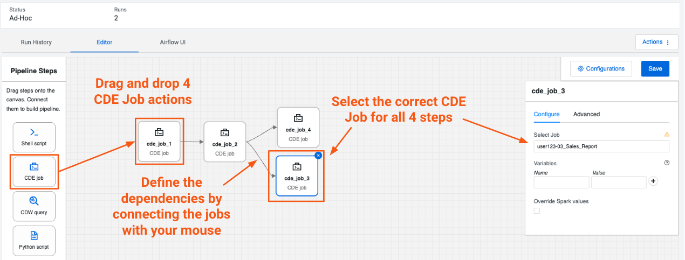

Next, for all of the CDE Jobs, open the configuration by clicking on the job on the canvas. Select "Depends on Past" and Trigger rule "all_success" for Jobs.

When you are done don't forget to save the DAG before the next step.

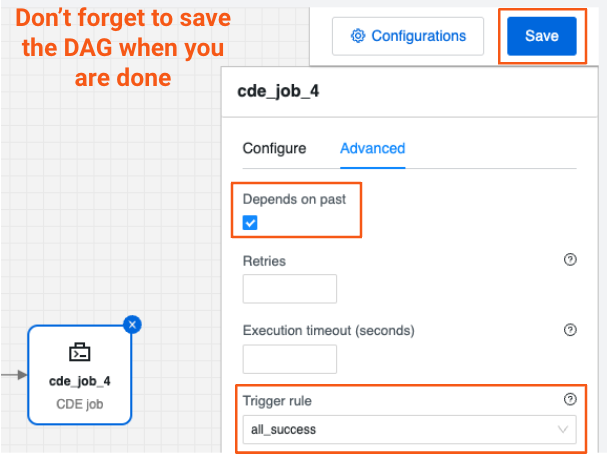

Finally, you can navigate back to "Jobs" and trigger the DAG to run all CDE Jobs you defined previously and observe it from the CDE Job Runs UI.

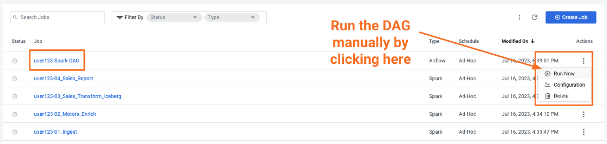

Switch back to your CDE Browser tab and monitor the execution of both the DAG and the individual CDE Spark Jobs. You may close the Browser tab for your Virtual Cluster now.

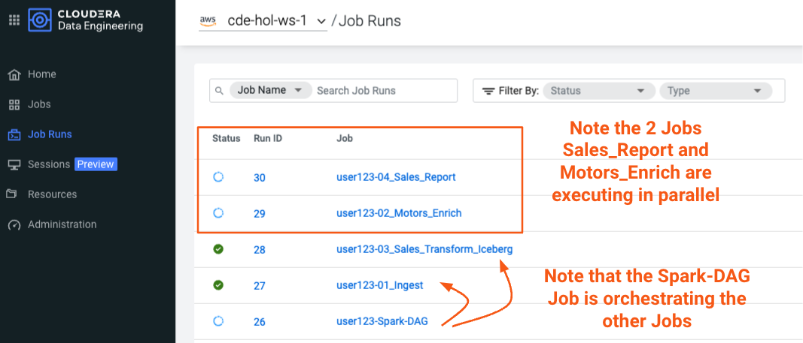

After all jobs have finished successfully you can continue to the next section.

#### 2.2 Airflow Connections

Before creating the next Airflow Job, you will create an Airflow Connection that can be referenced in your DAGs.

>**Note**
>Airflow Connections are used for storing credentials and other information necessary for connecting to external services. This feature allows managing potentially sensitive data in an encrypted backend. If you want to learn more about the Airflow Connection feature used in this lab, visit [the official Airflow Documentation for managing Connections in the Airflow metadata database](https://airflow.apache.org/docs/apache-airflow/stable/howto/connection.html).

To create your first Airflow Connection, navigate back to the CDE Administration tab, open your Virtual Cluster's "Cluster Details" and then click on the "Airflow" icon to reach the Airflow UI.


Open Airflow Connections under the Admin dropdown as shown below.


Airflow Connections allow you to predefine connection configurations so that they can be referenced within a DAG for various purposes. In our case, we will create a new connection to access the "Random Joke API" and in particular the "Programming" endpoint.


Fill out the following fields as shown below and save.

>**⚠ Warning**
>Specify the Connection Id with your username assigned to you by your Cloudera Workshop Lead, e.g "user123_random_joke_connection"

```
Connection Id: user123_random_joke_connection
Connection Type: HTTP
Host: https://official-joke-api.appspot.com/
```


#### 2.3 Python Approach to defining Airlow Job

Even though the CDE Airflow Editor is great for connecting multiple CDE & CDW Jobs, it only supports a limited number of Airflow features and Operators. Airflow's capabilities include a wide variety of operators, the ability to store temporary context values, connecting to 3rd party systems and overall the ability to implement more advanced orchestration use cases.

Using the "Airflow-Code-DAG.py" you will create a new CDE Airflow Job to showcase some more advanced Airflow features such as using the Airflow Connection created previously and the SimpleHttpOperator to send/receive API requests.

First, open the ["Airflow-Code-DAG.py"](./cde_airflow_jobs/Airflow-Code-Dag.py) and update your username as shown below:

>**⚠ Warning**
>Update the DAG with your username assigned to you by your Cloudera Workshop Lead, e.g "user123"

```python
username = "user123"

default_args = {
    "owner": username,
    ...
}
```

Next, try to familiarize yourself with the code. Some of the most notable aspects of this DAG include:

* The `SimpleHttpOperator` Operator is used to send a request to an API endpoint. This provides an optional integration point between CDE Airflow and 3rd Party systems or other Airflow services as requests and responses can be processed by the DAG. The `http_conn_id` is referencing the previously created Airflow Connection.

```python
api_call_1 = SimpleHttpOperator(
    task_id="random_joke_api_1",
    method="GET",
    http_conn_id=f"{username}_random_joke_connection",
    endpoint="/jokes/programming/random",
    headers={"Content-Type":"application/json"},
    response_check=lambda response: True if response.status_code == 200 else False,
    dag=airflow_tour_dag,
    do_xcom_push=True
)
```

* Task Execution defined with the `>>` operator no longer follows a linear sequence. API response task only executes when both API call tasks have completed successfully.

```python
start >> [api_call_1, api_call_2] >> api_response
```

* Because we use `do_xcom_push=True` when instantiating the SimpleHttpOperators, the responses are written to a DAG context variable. Now the response is temporarily stored for the duration of the Airflow Job and can be reused by other operators. Finally, the Python Operator executes the "_print_random_joke" method and outputs the response of the API call.

```python
def _print_random_joke(**context):
    return context["ti"].xcom_pull(task_ids=["random_joke_api_1", "random_joke_api_2"])

api_response = PythonOperator(
    task_id="print_random_joke",
    python_callable=_print_random_joke,
    dag=airflow_tour_dag
)
```

Finally, upload the script to your CDE Files Resource. Create a new CDE Job of type Airflow with the name "user123-Airflow-Code-DAG" and select the script from your CDE Resource.

>**⚠ Warning**
>Name your Airflow Job with your username assigned to you by your Cloudera Workshop Lead, e.g "user123-Airflow-Code-DAG"

Make sure to "Create" instead of "Create and Run" since this DAG is configured to run automatically.

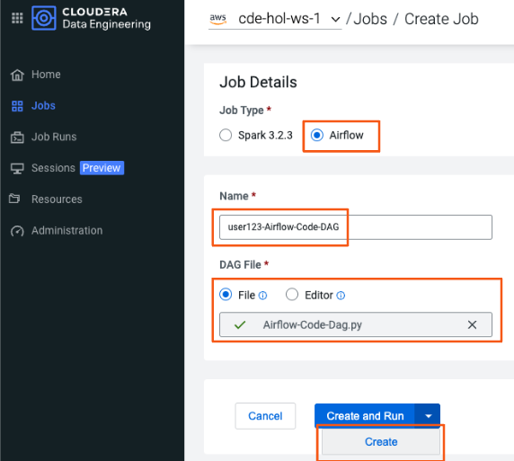

After the Airflow Job was created, navigate to the "Job Runs" tab and then to the logs of the "print_random_joke" task.

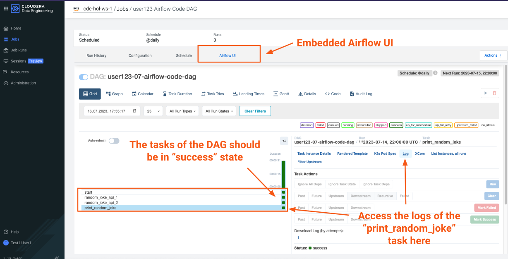

>**Note**
>The SimpleHttpOperator Operator can be used to interact with 3rd party systems and exchange data to and from a CDE Airflow Job run. For example you could trigger the execution of jobs outside CDP or execute CDE Airflow DAG logic based on inputs from 3rd party systems.

>**Note**  
>You can use CDE Airflow to orchestrate SQL queries in CDW, the Cloudera Data Warehouse Data Service, with the Cloudera-supported  CDWOperator. If you want to learn more, please go to [Bonus Lab 1: Using CDE Airflow with CDW](#bonus-lab-leverage-cde-airflow-to-orchestrate-cdw-workloads).

>**Note**  
>Additionally, other operators including Python, HTTP, and Bash are available in CDE. If you want to learn more about Airflow in CDE, please reference [Using CDE Airflow](https://github.com/pdefusco/Using_CDE_Airflow).

To learn more about CDE Airflow please visit [Orchestrating Workflows and Pipelines](https://docs.cloudera.com/data-engineering/cloud/orchestrate-workflows/topics/cde-airflow-editor.html) in the CDE Documentation.

## Lab 3: Explore Iceberg in Interactive Sessions

#### Summary

In this lab you will take advantage of the table format powering the Cloudera Data Lakehouse - Apache Iceberg. Using Iceberg's time travel capabilities in an CDE Interactive Session, you will be addressing the following data quality issues that have been reported to you by your business stakeholders.

>**⚠⚠⚠ Alert ⚠⚠⚠**:
> It turns out there is a quality issue in your data!
> 
> Business users of the **CAR_SALES** table have complained that this table contains duplicates that corrupt the downstream reporting dashboard.
> 
> It is your job now to troubleshoot and revert the table back to a healthy state if possible.

#### 3.1 Start an Interactive Session with Iceberg

From your CDE home page, navigate to the "Sessions" tab. Create 

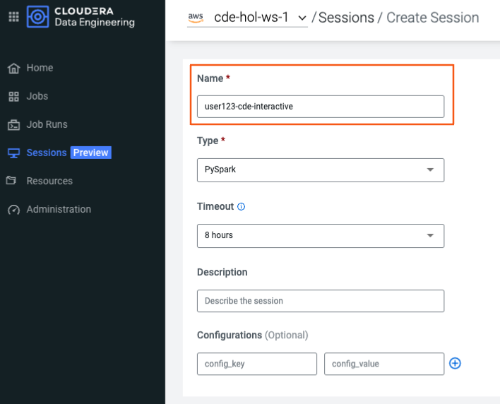

Wait for the Session resources to be provisioned, then navigate to the "Interact" tab.


As a first step, set your username variable for the commands to follow and verify that the shell is working as expected.

```python
username = "user123"
```

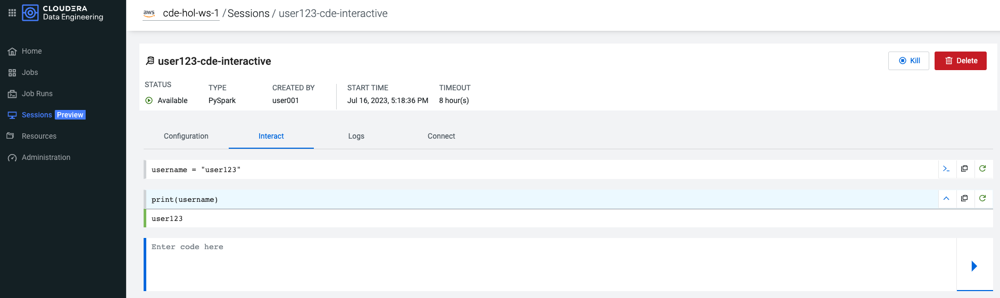

#### 3.2 Confirm the Data Quality Issues

With your Interactive Session in place, confirm the data quality issues that were reported to you by running the commands below:

```python
car_sales_df = spark.sql(f"SELECT * FROM {username}_CAR_DATA.CAR_SALES")
count_total = car_sales_df.count()
count_distinct = car_sales_df.distinct().count()
print(f"There are {count_distinct} unique records out of {count_total} total records in the CAR_SALES table.")
```

Expected output:
```
There are 3336 unique records out of 5615 total records in the CAR_SALES table.
```

#### 3.3 Identify the correct Snapshot and Revert the Table

In the first step you will explore the existing snapshots for the CAR_SALES that Iceberg creates with every write operation.

```python
spark.sql(f"SELECT * FROM spark_catalog.{username}_CAR_DATA.CAR_SALES.snapshots").show()
```

Expected output:
```
+--------------------+-------------------+-------------------+---------+--------------------+--------------------+
|        committed_at|        snapshot_id|          parent_id|operation|       manifest_list|             summary|
+--------------------+-------------------+-------------------+---------+--------------------+--------------------+
|2023-07-16 17:01:...|7747739539992707833|               null|   append|s3a://cde-hol-ws-...|{added-data-files...|
|2023-07-16 17:02:...|3929517884528544887|7747739539992707833|   append|s3a://cde-hol-ws-...|{spark.app.id -> ...|
|2023-07-16 17:02:...|2950758883762111157|3929517884528544887|   append|s3a://cde-hol-ws-...|{spark.app.id -> ...|
+--------------------+-------------------+-------------------+---------+--------------------+--------------------+
```

Next, you will explore the summary in more detail, explaining in detail what was changed with each write operation.

```python
car_sales_summary_df = spark.sql(f"SELECT summary FROM spark_catalog.{username}_CAR_DATA.CAR_SALES.snapshots")
summary = list(car_sales_summary_df.collect())
for n, s in enumerate(summary):
    print(f"Summary for snapshot number {n}: {s}\n")
```

Expected output:
```
Summary for snapshot number 0: Row(summary={'changed-partition-count': '6', 'added-data-files': '6', 'total-equality-deletes': '0', 'added-records': '3336', 'total-position-deletes': '0', 'added-files-size': '91779', 'total-delete-files': '0', 'total-files-size': '91779', 'total-records': '3336', 'total-data-files': '6'})

Summary for snapshot number 1: Row(summary={'spark.app.id': 'spark-4a99a736dc194def88d9263f580e0937', 'changed-partition-count': '6', 'added-data-files': '6', 'total-equality-deletes': '0', 'added-records': '991', 'total-position-deletes': '0', 'added-files-size': '37683', 'total-delete-files': '0', 'total-files-size': '129462', 'total-records': '4327', 'total-data-files': '12'})

Summary for snapshot number 2: Row(summary={'spark.app.id': 'spark-4a99a736dc194def88d9263f580e0937', 'changed-partition-count': '6', 'added-data-files': '6', 'total-equality-deletes': '0', 'added-records': '1288', 'total-position-deletes': '0', 'added-files-size': '42071', 'total-delete-files': '0', 'total-files-size': '171533', 'total-records': '5615', 'total-data-files': '18'})
```

The summary will show that the first snapshot contains exactly the number of unique records you found previously. Validate that the first snapshot contains only unique records.

```python
first_snapshot = spark.sql(f"SELECT snapshot_id FROM spark_catalog.{username}_CAR_DATA.CAR_SALES.snapshots").first()[0]
car_sales_df_clean = spark.read.format("iceberg").option("snapshot-id", first_snapshot).load(f"spark_catalog.{username}_CAR_DATA.CAR_SALES")
assert car_sales_df_clean.count() == car_sales_df_clean.distinct().count(), "unique value counts validation failed"
print("unique value counts validation successful")
```

Expected output:
```
unique value counts validation successful
```

After this has been validated you can revert the table.

```python
spark.sql(f"CALL spark_catalog.system.rollback_to_snapshot('{username}_CAR_DATA.CAR_SALES', {first_snapshot})").show()
```

Expected output:
```
+--------------------+-------------------+
|previous_snapshot_id|current_snapshot_id|
+--------------------+-------------------+
| 2950758883762111157|7747739539992707833|
+--------------------+-------------------+
```

Now the table can continue to be used by business stakeholders.

```python
car_sales_df = spark.sql(f"SELECT * FROM {username}_CAR_DATA.CAR_SALES")
count_total = car_sales_df.count()
count_distinct = car_sales_df.distinct().count()
print(f"There are {count_distinct} unique records out of {count_total} total records in the CAR_SALES table.")
```

Expected output:
```
There are 3336 unique records out of 3336 total records in the CAR_SALES table.
```

## Lab 4: Automate CDE Workflows with the CDE CLI

#### Summary

The majority of CDE Production use cases rely on the CDE API and CLI. With them, you can easily interact with CDE from a local IDE and build integrations with external 3rd party systems. For example, you can implement multi-CDE cluster workflows with GitLabCI or Python.  

In this part of the workshop you will gain familiarity with the CDE CLI by rerunning the same jobs and interacting with the service remotely.

You can use the CDE CLI or API to execute Spark and Airflow jobs remotely rather than via the CDE UI as shown up to this point. In general, the CDE CLI is recommended over the UI when running spark submits from a local machine. The API is instead recommended when integrating CDE Spark Jobs or Airflow Jobs (or both) with 3rd party orchestration systems. For example you can use GitLab CI to build CDE Pipelines across multiple Virtual Clusters. For a detailed example, please reference [GitLab2CDE](https://github.com/pdefusco/Gitlab2CDE).

#### 4.1 Install and Configure the CDE CLI

You can download the CDE CLI to your local machine following the instructions provided in the [official documentation](https://docs.cloudera.com/data-engineering/cloud/cli-access/topics/cde-cli.html).

1. Download the CDE CLI for your platform.


2. Follow the [steps outlined in the documentation](https://docs.cloudera.com/data-engineering/cloud/cli-access/topics/cde-download-cli.html) to make it executable.

```
chmod +x /path/to/cde
```

3. Verify that you can execute the binary by running `./cde`.

```
$ ./cde

Usage:
  cde [command]

Available Commands:
  airflow     Airflow commands
  backup      Create and Restore CDE backups
  credential  Manage CDE credentials
  help        Help about any command
  job         Manage CDE jobs
  profile     Manage CDE configuration profiles
  resource    Manage CDE resources
  run         Manage CDE runs
  session     Manage CDE sessions
  spark       Spark commands

...
```

4. Copy the "JOBS API URL" from your Virtual Cluster and save it somewhere so you can access it later.

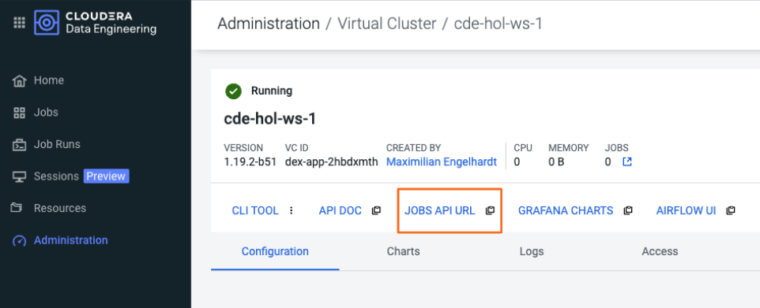

5. Set the CDP Workload Password for your user.


6. Verify you can browse the previously created Resources on your Virtual Cluster. You will be prompted for your Workload Password.

```bash
$ ./cde job list --user <your-username> --vcluster-endpoint <your-jobs-api-url> --skip-credentials-file
```

Expected output:

```
API User Password: 
[
  {
    "name": "user123-Airflow-Code-DAG",
    "type": "airflow",
    "created": "2023-07-16T17:47:28Z",
    "modified": "2023-07-16T17:47:28Z",
    "retentionPolicy": "keep_indefinitely",
    "mounts": [
      {
        "resourceName": "user123-cde-hol-files"
      }
    ],
    "airflow": {
      "dagID": "user123-07-airflow-code-dag",
      "dagFile": "Airflow-Code-Dag.py"
    },
    "schedule": {
      "enabled": true,
      "user": "user001",
      "cronExpression": "@daily",
      "start": "2019-12-31T23:00:00.000000Z",
      "nextExecution": "2023-07-16T22:00:00.000000Z"
    }
  },
  ...
```

>**Note**
>There are many [other options to configuring the CLI client](https://docs.cloudera.com/data-engineering/cloud/cli-access/topics/cde-cli-config-options.html) that you may use in real use cases. This example just shows the minimal setup with password prompting.

>**Note**
>You may want to create an alias for your command to avoid having to specify endpoint and username repeatedly.

```bash
alias cde_user123 = "./cde --user <your-username> --vcluster-endpoint <your-jobs-api-url> --skip-credentials-file"
```

#### 4.2 Run an Application using the CDE CLI

Similar to the well known `spark-submit` command, you may use the `cde spark submit` approach to directly running the "01_pyspark-sql.py" application.

```bash
$ ./cde spark submit ./cde_cli_jobs/01_pyspark-sql.py --user <your-username> --vcluster-endpoint <your-jobs-api-url> --skip-credentials-file
```

Expected output:

```
     3.0KB/3.0KB 100% [==============================================] 01_pyspark-sql.py
Job run 35 submitted
Waiting for job run 35 to start...  
...

root
 |-- name: string (nullable = true)
 |-- age: long (nullable = true)

root
 |-- person_name: string (nullable = false)
 |-- person_age: integer (nullable = false)

...

Waiting for job run 35 to terminate...  
Job run 35 succeeded
```

**Alternatively**, you can use the CDE CLI to manage your Spark applications similar to previous steps you have taken in the CDE UI during this workshop. The commands for that would be:

1. Upload the application file to your file resource.

```
$ ./cde resource upload --name user123-cde-hol-files --local-path ./cde_cli_jobs/01_pyspark-sql.py --user <your-username> --vcluster-endpoint <your-jobs-api-url> --skip-credentials-file
```

Expected output:
```
3.0KB/3.0KB 100% [==============================================] 01_pyspark-sql.py
```

2. Create the cde job referencing the uploaded application file.

```
./cde job create --name user123-cde-cli-job --type spark --application-file 01_pyspark-sql.py --mount-1-resource user123-cde-hol-files --user <your-username> --vcluster-endpoint <your-jobs-api-url> --skip-credentials-file
```

3. Run the cde job.

```
$ ./cde job run --name user123-cde-cli-job --wait --user <your-username> --vcluster-endpoint <your-jobs-api-url> --skip-credentials-file
```

Expected output:

```
Job run 36 submitted. Waiting...  
Job run 36 succeeded
```

4. Retrieve the metadata and logs for the run.

```
./cde run describe --id <your-run-id> --user <your-username> --vcluster-endpoint <your-jobs-api-url> --skip-credentials-file
./cde run logs --id <your-run-id> --user <your-username> --vcluster-endpoint <your-jobs-api-url> --skip-credentials-file
```

To learn about the difference between `cde spark submit` and cde job refer to the official documentation for [CDE concepts](https://docs.cloudera.com/data-engineering/cloud/cli-access/topics/cde-cli-concepts.html) and [Running a Spark job using the CLI](https://docs.cloudera.com/data-engineering/cloud/cli-access/topics/cde-cli-run-job.html) (excerpts below).

> Submitting versus running a job
> The cde spark submit and cde airflow submit commands automatically create a new job and a new resource, submit the job as a job run, and when the job run terminates they delete the job and resources.
> 
> A cde job run requires a job and all necessary resources to be created and uploaded to the CDE cluster beforehand. The advantage of creating resources and jobs ahead of time is that resources can be reused across jobs, and that jobs can be run using only a job name.
>
> Using the cde job run requires more preparation on the target environment compared to the cde spark submit command. Whereas cde spark submit is a quick and efficient way of testing a Spark job during development, cde job run is suited for production environments where a job is to be run multiple times, therefore removing resources and job definitions after every job run is neither necessary, nor viable.

## Bonus Lab 1: Visualize Job & Data Lineage in Atlas

#### Summary

Cloudera tracks and connects lineage for all CDP workloads and datasets via Apache Atlas. In this lab you are going to explore the metadata for our previously created jobs and datasets.

Navigate to the latest run of your "04_Motors_Enrich" Job and click on Lineage.

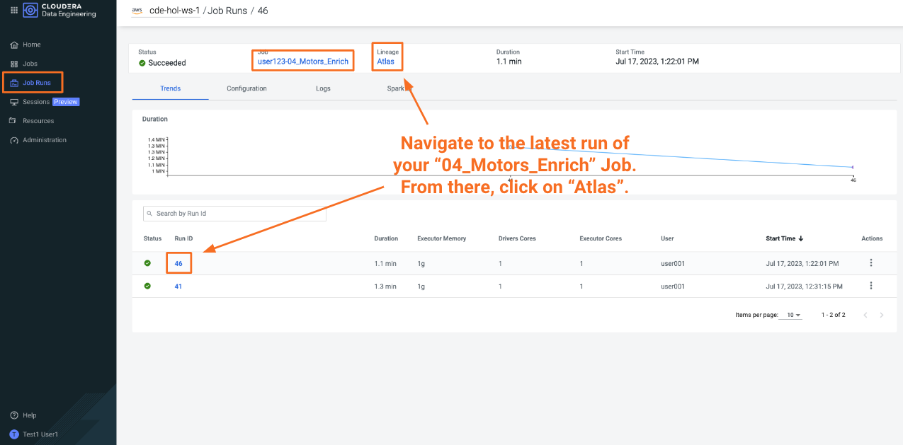

In Atlas, navigate to the "Lineage" tab.

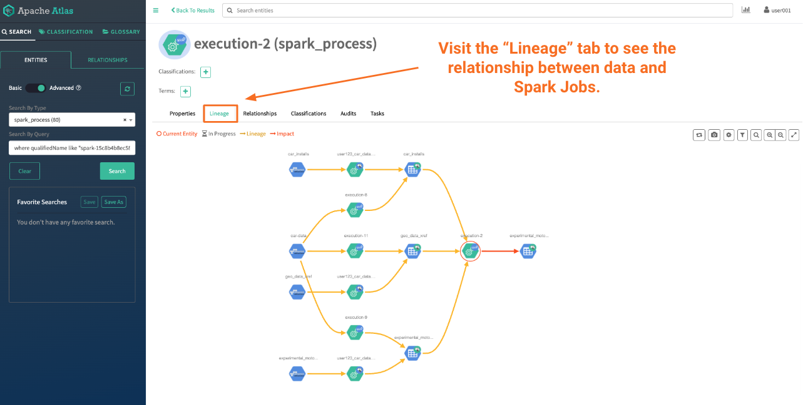

The "04_Motors_Enrich" Job joined multiple tables together. Try to see if you can identify the raw data files and their respective AWS S3 buckets that were used to build this table.

# Next Steps

CDE is the Cloudera Data Engineering Service, a containerized managed service for Spark and Airflow.

If you are exploring CDE you may find the following tutorials relevant:

* [Spark 3 & Iceberg](https://github.com/pdefusco/Spark3_Iceberg_CML): A quick intro of Time Travel Capabilities with Spark 3.

* [Simple Intro to the CDE CLI](https://github.com/pdefusco/CDE_CLI_Simple): An introduction to the CDE CLI for the CDE beginner.

* [CDE CLI Demo](https://github.com/pdefusco/CDE_CLI_demo): A more advanced CDE CLI reference with additional details for the CDE user who wants to move beyond the basics.

* [CDE Resource 2 ADLS](https://github.com/pdefusco/CDEResource2ADLS): An example integration between ADLS and CDE Resource. This pattern is applicable to AWS S3 as well and can be used to pass execution scripts, dependencies, and virtually any file from CDE to 3rd party systems and vice versa.

* [Using CDE Airflow](https://github.com/pdefusco/Using_CDE_Airflow): A guide to Airflow in CDE including examples to integrate with 3rd party systems via Airflow Operators such as BashOperator, HttpOperator, PythonOperator, and more.

* [GitLab2CDE](https://github.com/pdefusco/Gitlab2CDE): a CI/CD pipeline to orchestrate Cross-Cluster Workflows for Hybrid/Multicloud Data Engineering.

* [CML2CDE](https://github.com/pdefusco/cml2cde_api_example): an API to create and orchestrate CDE Jobs from any Python based environment including CML. Relevant for ML Ops or any Python Users who want to leverage the power of Spark in CDE via Python requests.

* [Postman2CDE](https://github.com/pdefusco/Postman2CDE): An example of the Postman API to bootstrap CDE Services with the CDE API.

* [Oozie2CDEAirflow API](https://github.com/pdefusco/Oozie2CDE_Migration): An API to programmatically convert Oozie workflows and dependencies into CDE Airflow and CDE Jobs. This API is designed to easily migrate from Oozie to CDE Airflow and not just Open Source Airflow.

For more information on the Cloudera Data Platform and its form factors please visit [this site](https://docs.cloudera.com/).

For more information on migrating Spark jobs to CDE, please reference [this guide](https://docs.cloudera.com/cdp-private-cloud-upgrade/latest/cdppvc-data-migration-spark/topics/cdp-migration-spark-cdp-cde.html).

If you have any questions about CML or would like to see a demo, please reach out to your Cloudera Account Team or send a message [through this portal](https://www.cloudera.com/contact-sales.html) and we will be in contact with you soon.


