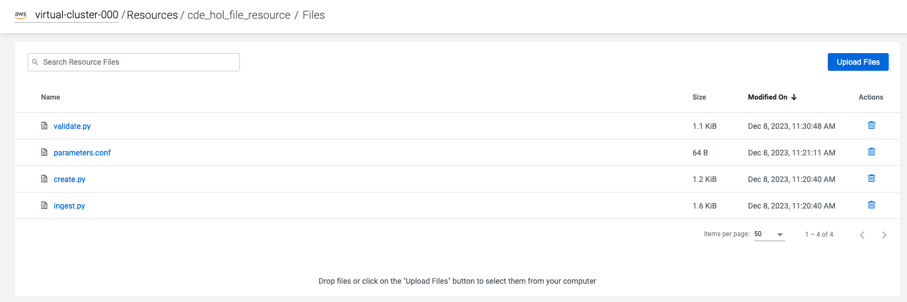

# Cloudera Data Engineering Hands-on Lab CEMEA

## Cloudera Data Engineering

Cloudera Data Engineering (CDE) is a managed, containerized Platform-as-a-Service for the Cloudera Data Platform designed for managing large-scale data pipelines based around Spark, Airflow and Iceberg. It allows you to submit batch jobs to auto-scaling virtual clusters with built-in multi-tenancy support. As a serverless service, CDE enables you to spend more time on your applications, and less time on infrastructure.

This hands-on lab is designed to walk you through the CDE's main capabilities. Throughout the exercises, you will:

1. [**Deploy** Spark Jobs in the CDE UI](#lab-1-manage-spark-jobs-in-the-cde-ui)
2. [**Validate** Data Quality with Iceberg](#lab-2-address-data-quality-with-iceberg)
3. [**Orchestrate** Data Pipelines in Airflow](#lab-3-orchestrate-data-pipelines-in-airflow)
4. [**Automate** Workflows with the CDE CLI](#lab-4-automate-workflows-with-the-cde-cli)
5. [**Visualize** the Results in Cloudera DataViz](#lab-5-visualize-the-results-in-cloudera-dataviz)

### Glossary

For an overview of terminology specific to CDE (e.g. Virtual Cluster, Interactive Sessions, etc.) please refer to the [glossary](GLOSSARY.md).

## Use Case Scenario


**Business Context:**

* You are a Data Engineer working for an electric vehicle startup.
* You were tasked to build a reliable data pipeline for sales reporting.
* You are to create a simple star schema with **sales** (facts) and **customers** (dimension).

**Requirements:**

* You will use CDE to deploy and orchestrate data pipelines for loading and validating the data.
* The source data is loaded in yearly batches from an S3 bucket.<br>
* The **sales** (fact) table is to be **appended**.
* The **customers** (dimension) table is to be **updated**.

**Source data on S3:**

```bash
$ aws s3 ls s3://<source-bucket>/ --recursive --human-readable

2023-12-05 14:50:37  431.9 KiB 2021/customers.csv
2023-12-05 14:50:26  104.6 KiB 2021/sales.csv
2023-12-05 14:51:11  170 Bytes 2022/customers.csv
2023-12-05 14:50:55  276.0 KiB 2022/sales.csv
```

# Step by Step Instructions

## Lab 0. Setup

### Clone this repo to the machine you will be using for the workshop.

```
mkdir cde-hol
cd cde-hol
git clone https://github.com/cloudera-cemea/CDE_vHoL.git
cd CDE_vHoL
```

Alternatively, if you don't have git installed on your machine, you can also manually download the files from https://github.com/cloudera-cemea/CDE_vHoL.

### Update the username in the parameters.conf file

Before you start the labs, open the "parameters.conf" file in the "resources_files" folder and edit the username as assigned by your Cloudera Workshop Lead.

```
[general]
s3BucketName: s3a://source-bucket
username: user123                                   <-- replace this with your assigned username
```

### Notes on Virtual Cluster assignments

Each user is assigned to a Virtual Cluster (1:1) following the same naming convention as your username.

```
Username    Virtual Cluster
---------------------------
user001     virtual-cluster-001
...         ...
user025     virtual-cluster-025
```

## Lab 1. Manage Spark Jobs in the CDE UI

### Overview

In this section, you will create, configure and execute Spark jobs manually via the CDE UI. You will manage application files and Python Virtual Environments with CDE Resources. CDE Resources can be of type "File", "Python", or "Custom Runtime". You will start by creating a File Resource to manage your application code (Spark and Airflow files) and dependencies. Then you will create a "Python Resource" to utilize custom Python libraries in a CDE Spark Job run. Finally, you will run the created jobs and validate the results.

You will work with the following Spark jobs that create the target schema, load data into it and run data quality checks.

* **create.py**: Creates the target schema and iceberg tables

```sql
CREATE DATABASE car_data
CREATE TABLE sales/customers ... USING ICEBERG
```

* **ingest.py**: Loads data in yearly batches; Appends sales data; Upserts customers data.

```sql
INSERT INTO car_data.sales ...
MERGE INTO car_data.customers ...
```

* **validate.py**: Runs data quality checks on the loaded data.

```python
from great_expectations.dataset.sparkdf_dataset import SparkDFDataset
assert customers_gdf.expect_column_to_exist("customer_id").success
```

### Create a File Resource for your Spark jobs

To get started, navigate to the CDE Service from the CDP Home Page by clicking on the blue "Data Engineering" icon. From the CDE Home page, create a new File resource. CDE Resources can be of type "File", "Python", or "Custom Runtime". You will start by creating a resource of type "File" to get started with your first Spark jobs.

1. First, navigate to the CDE Service from the CDP Home Page by clicking on the blue "Data Engineering" icon.
2. To create a File Resource, from the CDE Home Page click on "Create New" in the "Resources" -> "File" section.

<br>

3. Name the File Resource e.g. "cde_hol_file_resource" (making sure your Virtual Cluster is selected.)

<br>

4. Upload the files listed below located in the "cde_spark_jobs" and "resources_files" folders.

```
cde_spark_jobs
├── create.py
├── ingest.py
└── validate.py

resources_files
└── parameters.conf
```

4. Make sure all the files listed above are located in your File Resource!

<br>

### Create a Python Resource for the Data Quality Job

Notice how the job "validate.py" imports the grea_expectations library to utilize modules for data quality checks. For your PySpark jobs to be able to make use of this dependency, you will create a new resource of type "Python Resource" in this section. This will build a Python Virtual Environment under the hood that any of your CDE Spark Jobs can utilize from there on.

1. Navigate back to the CDE Home Page and click on "Create New" in the "Resources" -> "Python" section.

<

2. With your Virtual Cluster selected, name the Python CDE Resource, e.g. "cde_hol_python". Leave the PyPI mirror field blank.

<br>

3. Upload the "requirements.txt" file provided in the "./resources_files" folder.

<br>

4. Notice the CDE Resource is now building the Python Virtual Environment. After a few moments, the build will complete and you will be able to validate the libraries used. Validate that the "great-expectations" library was installed by searching for it.

<br>

To learn more about CDE Resources please visit [Using CDE Resources](https://docs.cloudera.com/data-engineering/cloud/use-resources/topics/cde-python-virtual-env.html) in the CDE Documentation.

### Create and Run Your First CDE Spark Jobs

With the resources in place, you will now create Spark Jobs based on your "create.py", "ingest.py" and "validate.py" File Resources. By decoupling Spark Jobs from application files, CDE allows you to fully manage, configure, schedule and monitor your Spark jobs, rather than just running "spark-submit" commands (but of course you can still do that with CDE if you choose to).

First, you will create the jobs for "create.py":

1. Navigate back to the CDE Home Page. Click on "Create New" in the "Jobs" -> "Spark" section.

<br>

2. Name your job e.g. "create" and scroll down to select "File" from the radio button and click on "Select from Resource" in the "Application File" section.  A window will open with your File Resource where you select the "create.py" file.

<br>

3. Scroll to the bottom and click on the "Create and Run" blue icon. The job will now be executed, which may take a few minutes.

4. Repeat steps 1. through 3. for the "ingest" job.

5. Confirm both CDE Spark Jobs were created and executed successfully by browsing the "Job Runs" tab

<br>

### A Note on File Resources and Spark Jobs in CDE

FYI: Scroll down again and toggle the "Advanced" section. Here, under the "Resources" section you can notice that your File Resource has been mapped to the Job by default. This allows your Spark application to access files at runtime, such as the "parameters.conf" file you have uploaded to your File Resource earlier. Your Spark application can then access the file e.g. as follows:

```python
config = configparser.ConfigParser()
config.read("/app/mount/parameters.conf")
USERNAME = config.get("general","username")
```

### Create and Run the "validate" Job with custom Python Dependencies

You may have noticed in the Overview section that the "validate.py" script utilizes the "great-expectations" library that you created earlier in a Python Resource.

1. To create the "validate" CDE Spark Job with this custom dependency, follow the same steps as above, but make sure you add the Python Environment config and select your Python Resource from earlier.

<br>

2. After "Create and Run", wait for job completion and verify that the job has finished successfully. **It turns out that the "validate" Job has failed!**

<br>

### Check the Logs to Investigate the Failed "validate" Job

1. From the "Job Runs" tab click on the failed Run ID of the "validate" Job to get an overview of the Job and specific Job Runs.
2. To get to the logs of the failed job, navigate to "Logs" -> "stdout" and see if you can find what went wrong!

<br>

3. Solution: It turns out our sales table contains duplicates for the "customer_id" and "VIN" fields. That's not good, as each customer should only be able to buy a single car once!

```
...
AssertionError: VALIDATION FOR SALES TABLE UNSUCCESSFUL: FOUND DUPLICATES IN [customer_id, VIN].
...
```

**Infobox: Monitoring CDE Spark Jobs**
> The Job Run is populated with Metadata, Logs, and the Spark UI. This information is persisted and can be referenced at a later point in time.
> * The Configuration tab allows you to verify the script and resources used by the CDE Spark Job.
> * The Logs tab contains rich logging information. For example, you can verify your code output under "Logs" -> "Driver" -> "stdout".
> * The Spark UI allows you to visualize resources, optimize performance and troubleshoot your Spark Jobs.

## Lab 2. Address Data Quality with Iceberg

### Overview

To address the data quality findings, you will now take advantage of the table format powering the Cloudera Data Lakehouse: [Apache Iceberg](./GLOSSARY.md#apache-iceberg). Using Iceberg's time travel capabilities in a CDE Interactive Session, you will be addressing the data quality issues you have found in the previous lab.

> **⚠** It turns out there are quality issues with your data. **⚠** <br>
> Your data quality checks have found that the **sales** table contains duplicates. <br>
> It is your job now to troubleshoot and revert the table back to a healthy state if possible. <br>

### Create an Interactive Session with Iceberg

1. From your CDE home page, navigate to the "Sessions" tab to create your session. Name the session e.g. "user123-session".

<br>

2. Wait for the Session resources to be provisioned, then navigate to the "Interact" tab.

<br>

3. As a first step, set your username variable for the commands to follow and verify that the shell is working as expected.

```python
username = "user123"
print(username)
```

### Verify the Data Quality Issues

With your Interactive Session running, you will now confirm the data quality issues in the sales table.

> **Infobox: Time Travel with Iceberg**
> * Recall the sales data is ingested in two batches, one for 2021, one for 2022.
> * Iceberg creates a new snapshot with every write operation (inserts, updates, deletes).
> * Note we're using the syntax `catalog.database.table.snapshots` to access the table history.

1. Verify the duplicates by comparing total counts to distinct counts for the fields "customer_id" and "VIN".

```python
sales_df = spark.sql(f"SELECT * FROM car_data_{username}.sales")
count_total = sales_df.count()
count_distinct = sales_df.select("customer_id", "VIN").distinct().count()
print(f"Total count: {count_total} vs. unique [customer_id, VIN] count: {count_distinct}.")
```

2. Check the table history by inspecting the Iceberg snapshots. You should see two snapshots in the sales table.

```python
spark.sql(f"SELECT * FROM spark_catalog.car_data_{username}.sales.snapshots").show()
```

Expected output:
```
+--------------------+-------------------+-------------------+---------+--------------------+--------------------+
|        committed_at|        snapshot_id|          parent_id|operation|       manifest_list|             summary|
+--------------------+-------------------+-------------------+---------+--------------------+--------------------+
|2023-12-09 00:01:...|7356121065394951566|               null|   append|s3a://cde-hol-buk...|{spark.app.id -> ...|
|2023-12-09 00:01:...| 362831684775421239|7356121065394951566|   append|s3a://cde-hol-buk...|{spark.app.id -> ...|
+--------------------+-------------------+-------------------+---------+--------------------+--------------------+
```

3. Check if the duplicates were introduced by a specific batch. It turns out that the second batch insert introduced the duplicates.

```python
snapshot_ids = spark.sql(f"SELECT snapshot_id FROM spark_catalog.car_data_{username}.sales.snapshots").collect()
for snapshot_id in snapshot_ids:
    sales_df = spark.read.format("iceberg").option("snapshot-id", snapshot_id[0]).load(f"spark_catalog.car_data_{username}.sales")
    count_total = sales_df.count()
    count_distinct = sales_df.select("customer_id", "VIN").distinct().count()
    print(f"Snapshot {snapshot_id} total count: {count_total} vs. unique [customer_id, VIN] count: {count_distinct}")
```

Expected output:

```
Snapshot Row(snapshot_id=7356121065394951566) total count: 1874 vs. unique [customer_id, VIN] count: 1874
Snapshot Row(snapshot_id=362831684775421239) total count: 6819 vs. unique [customer_id, VIN] count: 6667
```

### Revert the Table to an Uncorrupted State

> **Note** <br>
> For the remainder of the workshop, executing the below is optional and not required. You can ignore the duplicates for now, as we will re-run the full pipeline in the next section.

Thanks to Iceberg there are new and safer options to address this issue, depending on the business needs.

* **Option A**: If having access to the latest batch is not critical, you can revert the table to the state before the second batch insert. This is done in Iceberg using the Spark rollback procedure:

```python
first_snapshot = spark.sql(f"SELECT snapshot_id FROM spark_catalog.car_data_{username}.sales.snapshots").first()[0]
spark.sql(f"CALL spark_catalog.system.rollback_to_snapshot('car_data_{username}.sales', {first_snapshot})").show()
```

Would result in:

```
+--------------------+-------------------+
|previous_snapshot_id|current_snapshot_id|
+--------------------+-------------------+
|  362831684775421239|7356121065394951566|
+--------------------+-------------------+
```

* **Option B**: You can simply drop the duplicates using PySpark. Note that this will again create a new snapshot, so if this turns out to be the wrong approach you can always revert the table again.

```python
sales_df_cleaned = sales_df.dropDuplicates(["customer_id", "VIN"])
sales_df_cleaned.createOrReplaceTempView("sales_df_cleaned")
spark.sql(f"INSERT OVERWRITE car_data_{username}.sales SELECT * FROM sales_df_cleaned")
```

Would result in a new snapshot. Note the **overwrite** snapshot as a result of the INSERT OVERWRITE statement:

```
+--------------------+-------------------+-------------------+---------+--------------------+--------------------+
|        committed_at|        snapshot_id|          parent_id|operation|       manifest_list|             summary|
+--------------------+-------------------+-------------------+---------+--------------------+--------------------+
|2023-12-09 10:42:...|2653522877398178198|               null|   append|s3a://cde-hol-buk...|{spark.app.id -> ...|
|2023-12-09 10:42:...|2162976375477413462|2653522877398178198|   append|s3a://cde-hol-buk...|{spark.app.id -> ...|
|2023-12-09 11:23:...|1434134148231443461|2162976375477413462|overwrite|s3a://cde-hol-buk...|{spark.app.id -> ...|
+--------------------+-------------------+-------------------+---------+--------------------+--------------------+
```

## Lab 3. Orchestrate Data Pipelines in Airflow

### Overview

You have already created and executed Spark Jobs manually via the CDE UI. In this section, you will learn how to create Airflow Jobs to schedule, orchestrate and monitor the execution of data pipelines consisting of multiple Spark Jobs on CDE.

You will also learn about:
- Navigating the Airflow UI
- Code and No-Code approaches to defining Airflow Jobs
- Airflow Key Concepts including DAGs, Operators, Connections

### Create and Schedule an Airflow DAG with the Visual Editor

You can use the CDE Airflow Editor to build DAGs without writing code. This is a great option if your DAG consists of a long sequence of CDE Spark or CDW Hive jobs. In this section you will build a simple pipeline to orchestrate the CDE Spark Jobs you created before.

1. Create your Airflow Job from the home page, and name it e.g. "pipeline"
2. Using the Visual Editor, chain together the 3 CDE Spark Jobs "create", "ingest" and "validate".
3. Within the Visual Editor, configure the Airflow Job with the following:

```
start_date: yesterday's date, e.g. 2023-12-11
end_date: some date in the future, e.g. 2023-12-31
schedule: @daily
catch_up: true
```

### Navigate through the Airflow UI to Monitor your Pipeline

1. From the "Jobs" tab, navigate to your Airflow Job and click on "Airflow UI".

<br>

2. In the Airflow UI, explore both the "Grid" (default) and the "Graph" view of your DAG. It should show the expected Jobs with 2 in "success" and 1 in "failed" status.

<br>

3. In the Airflow UI, navigate to the "Code" and check the resulting code file, which should look similar to this:

```python
from airflow import DAG
from airflow.utils import timezone
from cloudera.cdp.airflow.operators.cde_operator import CDEJobRunOperator
from datetime import timedelta
from dateutil import parser

dag = DAG(
    dag_id='mydag',
    start_date=parser.isoparse('2023-12-07').replace(tzinfo=timezone.utc),
    end_date=parser.isoparse('2023-12-13').replace(tzinfo=timezone.utc),
    schedule_interval='@daily',
    catchup=True,
    is_paused_upon_creation=False,
    default_args={
        'owner': 'mengelhardt',
    },
)

cde_job_1 = CDEJobRunOperator(
    job_name='create',
    task_id='cde_job_1',
    dag=dag,
)

cde_job_2 = CDEJobRunOperator(
    job_name='ingest',
    task_id='cde_job_2',
    dag=dag,
)

cde_job_3 = CDEJobRunOperator(
    job_name='validate',
    task_id='cde_job_3',
    dag=dag,
)

cde_job_2 << [cde_job_1]
cde_job_3 << [cde_job_2]
```

### Build a Materialized View with the CDWOperator

- optional for advanced participants

```
CREATE MATERIALIZED VEW sales_report_mv AS
SELECT c.occupation, s.sales_price FROM car_data_user000.sales s
JOIN car_data_{USERNAME}.customers c ON s.customer_id = c.customer_id
GROUP BY c.occupation
ORDER BY s.sales_price
```

1. CDW Virtual Warehouse Connection
2. Add CDWOperator

## Lab 4. Automate Workflows with the CDE CLI

### Overview

You've seen how to manage both Spark and Airflow Jobs using the CDE UI, what's left to do? Leverage the CDE CLI to automate your workflows, e.g. to enable CI/CD.

### Configure and run the CDE CLI using Docker (recommended)

0. Create a Workload Password for your CDP User.

<br>
<br>

1. Update the file "cde_cli/config/creds.txt" with your Workload password.

```
<workload-password>
```

2. Retrieve your Virtual Jobs API URL.

<br>

3. Update the file "cde_cli/config/env.cfg" with your Virtual Cluster JOBS API and your username.

```
CDE_USER=<username>
CDE_VCLUSTER_ENDPOINT=<jobs-api-url>
CDE_AUTH_PASS_FILE=/home/cdeuser/config/creds.txt
```

3. Run the CDE CLI without further setup. Note that the "cde_cli/config" directory is mounted from your host into the container.

```bash
bash ./cde_cli/run.sh
```

Should give you a bash terminal in the CDE CLI container.

```
cdeuser@8c2b6432370d:~$ cde

Usage:
  cde [command]

Available Commands:
  airflow     Airflow commands
  backup      Create and Restore CDE backups
  credential  Manage CDE credentials
  help        Help about any command
  job         Manage CDE jobs
  profile     Manage CDE configuration profiles
  resource    Manage CDE resources
  run         Manage CDE runs
  session     Manage CDE sessions
  spark       Spark commands

...

```

### Alternatively: Set up the CDE CLI manually (not recommended)

If you do not have Docker installed, you may download and set up the CDE CLI binary directly by following the instructions provided in the [official documentation](https://docs.cloudera.com/data-engineering/cloud/cli-access/topics/cde-cli.html). Note that the configuration steps may differ slightly from the Docker setup based on your environment.

### Execute your Airflow Job from the CDE CLI

1. Run the Airflow Job from the CLI. Note that this will trigger the entire pipeline to run again. The response will be the Run ID for the Job Run.

```bash
cdeuser@4b2fb5fe2cc5:~$ cde job run --name mydag

{
  "id": 32
}
```

2. Verify from the CDE and Airflow UIs that the pipeline is running as expected.

> **Infobox: Leveraging the CDE CLI**
> * The CDE CLI allows you to manage the full life cycle of your applications on CDE.
> * For some examples, please refer to the [CDE CLI Demo](https://github.com/pdefusco/CDE_CLI_demo), a more advanced CDE CLI reference with additional details for the CDE user who wants to move beyond the basics.

## Lab 5. Visualize the Results in Cloudera DataViz

### Overview

- CDV deployed on CDW
- CDV data models overview
- upload the existing artifact to CDV

# Next Steps

CDE is the Cloudera Data Engineering Service, a containerized managed service for Spark and Airflow.

If you are exploring CDE you may find the following tutorials relevant:

* [Spark 3 & Iceberg](https://github.com/pdefusco/Spark3_Iceberg_CML): A quick intro of Time Travel Capabilities with Spark 3.

* [Simple Intro to the CDE CLI](https://github.com/pdefusco/CDE_CLI_Simple): An introduction to the CDE CLI for the CDE beginner.

* [CDE CLI Demo](https://github.com/pdefusco/CDE_CLI_demo): A more advanced CDE CLI reference with additional details for the CDE user who wants to move beyond the basics.

* [CDE Resource 2 ADLS](https://github.com/pdefusco/CDEResource2ADLS): An example integration between ADLS and CDE Resource. This pattern is applicable to AWS S3 as well and can be used to pass execution scripts, dependencies, and virtually any file from CDE to 3rd party systems and vice versa.

* [Using CDE Airflow](https://github.com/pdefusco/Using_CDE_Airflow): A guide to Airflow in CDE including examples to integrate with 3rd party systems via Airflow Operators such as BashOperator, HttpOperator, PythonOperator, and more.

* [GitLab2CDE](https://github.com/pdefusco/Gitlab2CDE): a CI/CD pipeline to orchestrate Cross-Cluster Workflows for Hybrid/Multicloud Data Engineering.

* [CML2CDE](https://github.com/pdefusco/cml2cde_api_example): an API to create and orchestrate CDE Jobs from any Python based environment including CML. Relevant for ML Ops or any Python Users who want to leverage the power of Spark in CDE via Python requests.

* [Postman2CDE](https://github.com/pdefusco/Postman2CDE): An example of the Postman API to bootstrap CDE Services with the CDE API.

* [Oozie2CDEAirflow API](https://github.com/pdefusco/Oozie2CDE_Migration): An API to programmatically convert Oozie workflows and dependencies into CDE Airflow and CDE Jobs. This API is designed to easily migrate from Oozie to CDE Airflow and not just Open Source Airflow.

For more information on the Cloudera Data Platform and its form factors please visit [this site](https://docs.cloudera.com/).

For more information on migrating Spark jobs to CDE, please reference [this guide](https://docs.cloudera.com/cdp-private-cloud-upgrade/latest/cdppvc-data-migration-spark/topics/cdp-migration-spark-cdp-cde.html).

If you have any questions about CML or would like to see a demo, please reach out to your Cloudera Account Team or send a message [through this portal](https://www.cloudera.com/contact-sales.html) and we will be in contact with you soon.


