# Cloudera Data Engineering Hands-on Lab CEMEA

## Cloudera Data Engineering

Cloudera Data Engineering (CDE) is a managed, containerized Platform-as-a-Service for the Cloudera Data Platform designed for managing large-scale data pipelines based around Spark, Airflow and Iceberg. It allows you to submit batch jobs to auto-scaling virtual clusters with built-in multi-tenancy support. CDE enables you to spend more time on your applications, and less time on infrastructure, while staying in control of scale and cost.

This hands-on lab is designed to walk you through the CDE's main capabilities. Throughout the exercises, you will:

1. [**Deploy** Spark Jobs in the CDE UI](#lab-1-manage-spark-jobs-in-the-cde-ui)
2. [**Validate** Data Quality with Iceberg](#lab-2-address-data-quality-with-iceberg)
3. [**Orchestrate** Data Pipelines in Airflow](#lab-3-orchestrate-data-pipelines-in-airflow)
4. [**Automate** Workflows with the CDE CLI](#lab-4-automate-workflows-with-the-cde-cli)

### Glossary

For an overview of terminology specific to CDE (e.g. Virtual Cluster, Interactive Sessions, etc.) please refer to the [glossary](GLOSSARY.md).

## Use Case Scenario

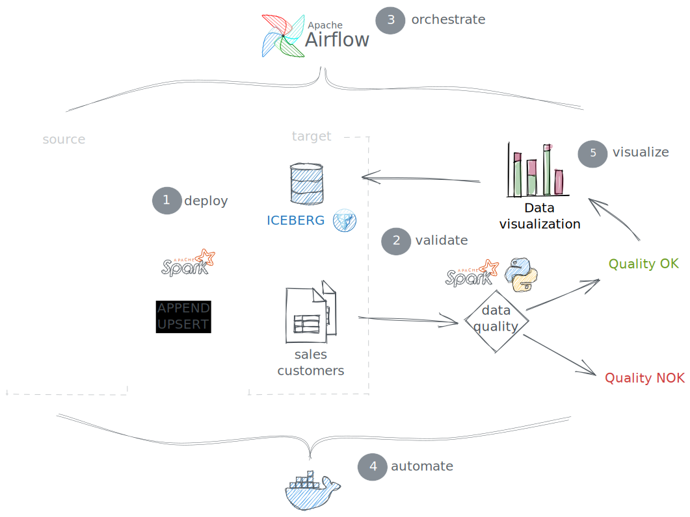

**Overview**

* You learn how to use CDE to create, deploy and orchestrate data pipelines
* You create a simple star schema with **sales** (facts) and **customers** (dimension).
* You load data into the schema and run basic data quality checks
* You discover automation features e.g. for CI/CD use cases

**Source data on S3:**

* The source data is loaded in yearly batches from an S3 bucket.
* The **sales** (fact) table is to be **appended**.
* The **customers** (dimension) table is to be **updated**.

```bash
$ aws s3 ls s3://<source-bucket>/ --recursive --human-readable

2023-12-05 14:50:37  431.9 KiB 2021/customers.csv
2023-12-05 14:50:26  104.6 KiB 2021/sales.csv
2023-12-05 14:51:11  170 Bytes 2022/customers.csv
2023-12-05 14:50:55  276.0 KiB 2022/sales.csv
```

**Notes on Virtual Clusters**

Each user is assigned to a Virtual Cluster (1:1) following the same naming convention as your username.

    Username    Virtual Cluster
    ---------------------------
    user001     virtual-cluster-001
    ...         ...
    user025     virtual-cluster-025

# Step by Step Instructions

## Lab 1. Manage Spark Jobs in the CDE UI

### Overview

In this section, you will create, configure and execute Spark Jobs manually via the CDE UI. You will learn how to use application files hosted on GitHub and create Python Virtual Environments. Finally, you will create and run CDE Spark Jobs and validate the results.

You will work with the following Spark Jobs that create the target schema, load data into it and run data quality checks.

* [**create.py**](https://github.com/cloudera-cemea/CDE_vHoL/blob/main/cde_spark_jobs/create.py): Creates the target schema and iceberg tables

```sql
CREATE DATABASE car_data
CREATE TABLE sales/customers ... USING ICEBERG
```

* [**ingest.py**](https://github.com/cloudera-cemea/CDE_vHoL/blob/main/cde_spark_jobs/ingest.py): Loads data in yearly batches; Appends sales data; Upserts customers data.

```sql
INSERT INTO car_data.sales ...
MERGE INTO car_data.customers ...
```

* [**validate.py**](https://github.com/cloudera-cemea/CDE_vHoL/blob/main/cde_spark_jobs/validate.py): Runs data quality checks on the loaded data.

```python
from great_expectations.dataset.sparkdf_dataset import SparkDFDataset
sales_gdf.expect_compound_columns_to_be_unique(["customer_id", "VIN"])
```

### Set up the Repository on CDE

From the CDE home page, navigate to Repositories > Create Repository.

    Repository Name: <username>-repository
    URL: https://github.com/cloudera-cemea/CDE_vHoL
    Branch: main
    Credential: Leave blank
    TLS: Leave unchecked

### Create and Run Your First CDE Spark Jobs

With the repository set up, you will now create Spark Jobs based on your "create.py" and "ingest.py" scripts. By decoupling Spark Jobs from application files, CDE allows you to fully manage, configure, schedule and monitor your Spark Jobs, rather than just running "spark-submit" commands (but of course you can still do that with CDE if you choose to).

First, you will create the jobs for "**create.py**":

1. Navigate back to the CDE home page. Click on "Create New" in the "Jobs" -> "Spark" section.

<br>

2. Name your job e.g. "create" and select "Repository" as the "Application File" and choose the corresponding script.

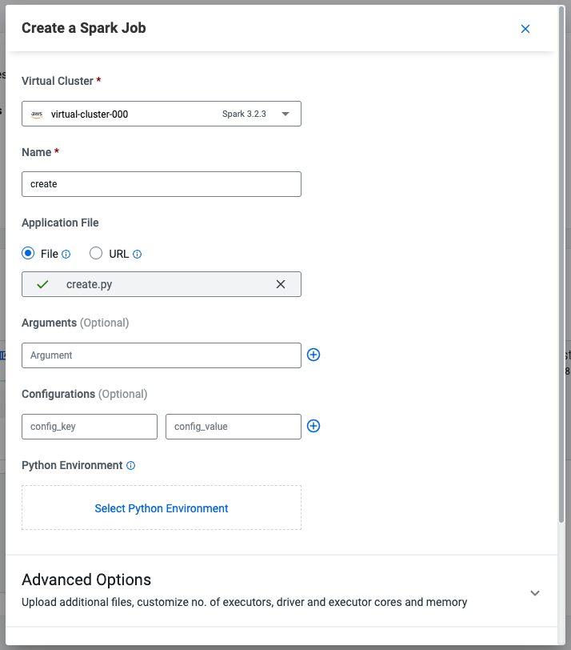<br>

3. Scroll to the bottom and click on the "Create and Run" blue icon. The job will now be executed, which may take a minute.

4. Confirm your "create" CDE Spark Job was created and executed successfully by browsing the "Job Runs" tab

5. Repeat steps 1. through 4. for the "**ingest.py**" script. Both Jobs should have finished successfully!

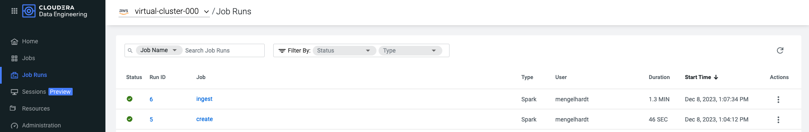<br>

### A Note on mounting File Resources to Spark Jobs in CDE

FYI: Scroll down again and toggle the "Advanced" section. Here, under the "Resources" section you can notice that your Repository has been mapped to the Job by default. This allows your Spark application to access all files from the repository at runtime, such as the "resources_files/parameters.conf" file. Your Spark application can then access the file e.g. as shown in the ingest.py script:

```python
config = configparser.ConfigParser()
config.read("/app/mount/resources_files/parameters.conf")
S3_BUCKET = config.get("general", "s3BucketName")
```

### Create a Python Virtual Environment for the Data Quality Job

Notice how the job "**validate.py**" imports the great-expectations library to utilize modules for data quality checks. For your PySpark Jobs to be able to make use of third-party Python dependencies, you will create a new resource of type "Python Resource" in this section. This will build a Python Virtual Environment under the hood that any of your CDE Spark Jobs can utilize from there on.

For more information on great-expectations also check out the docs: https://docs.greatexpectations.io/docs

1. Navigate back to the CDE home page and click on "Create New" in the "Resources" -> "Python" section.

<

2. With your Virtual Cluster selected, name the Python CDE Resource, e.g. "cde_hol_python". Leave the PyPI mirror field blank.

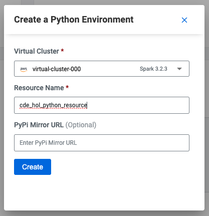<br>

3. Upload the "requirements.txt" file. If you haven't cloned this repository, you must first download the file from this URL https://github.com/cloudera-cemea/CDE_vHoL/blob/main/resources_files/requirements.txt to your machine.

<br>

4. Notice the CDE Resource is now building the Python Virtual Environment. After a few moments, the build will complete and you will be able to validate the libraries used. Validate that the "great-expectations" library was installed by searching for it.

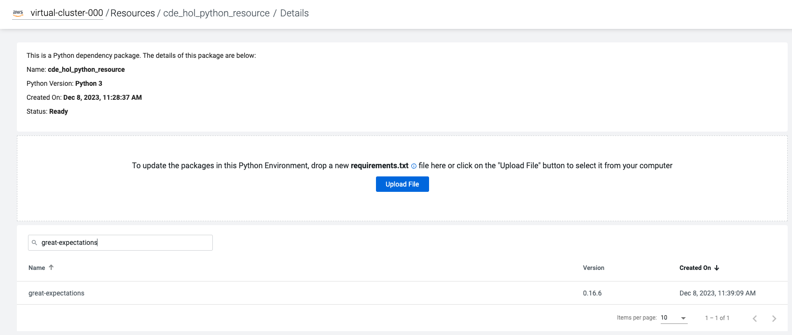<br>

To learn more about CDE Resources please visit [Using CDE Resources](https://docs.cloudera.com/data-engineering/cloud/use-resources/topics/cde-python-virtual-env.html) in the CDE Documentation.


### Create and Run the "validate" Job with the created Python Virtual Environment

1. To create the "validate" CDE Spark Job with the Python Virtual Environment, follow the same steps as above, but make sure you add the Python Environment config and select your Python Resource from earlier.

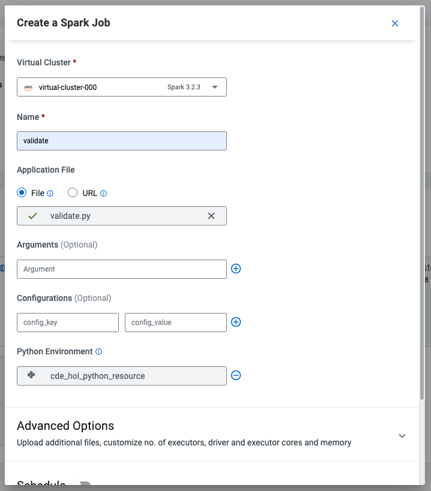<br>

2. After "Create and Run", wait for job completion and verify that the job has finished successfully. **It turns out that the "validate" Job has failed!**

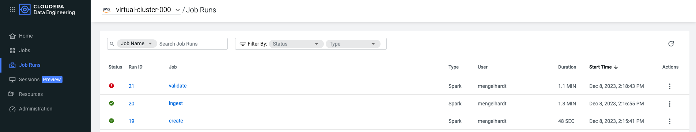<br>

### Check the Logs to Investigate the Failed "validate" Job

1. From the "Job Runs" tab click on the failed Run ID of the "validate" Job to get an overview of the Job and specific Job Runs.
2. To get to the logs of the failed job, navigate to "Logs" -> "stdout" and see if you can find what went wrong!

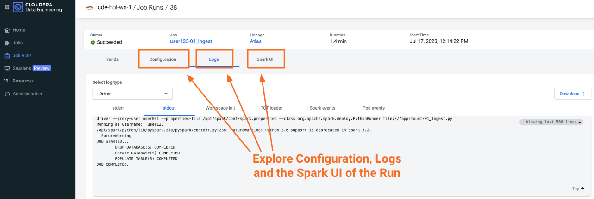<br>

3. Solution: It turns out our sales table contains duplicates for the "customer_id" and "VIN" fields. That's not good, as each customer should only be able to buy a single car once!

```
...
AssertionError: VALIDATION FOR SALES TABLE UNSUCCESSFUL: FOUND DUPLICATES IN [customer_id, VIN].
...
```

**Infobox: Monitoring CDE Spark Jobs**
> The Job Run is populated with Metadata, Logs, and the Spark UI. This information is persisted and can be referenced at a later point in time.
> * The Configuration tab allows you to verify the script and resources used by the CDE Spark Job.
> * The Logs tab contains rich logging information. For example, you can verify your code output under "Logs" -> "Driver" -> "stdout".
> * The Spark UI allows you to visualize resources, optimize performance and troubleshoot your Spark Jobs.

## Lab 2. Address Data Quality with Iceberg

### Overview

To address the data quality findings, you will now take advantage of the table format powering the Cloudera Data Lakehouse: [Apache Iceberg](./GLOSSARY.md#apache-iceberg). Using Iceberg's time travel capabilities in a CDE Interactive Session, you will be addressing the data quality issues you have found in the previous lab.

> **⚠** It turns out there are quality issues with your data. **⚠** <br>
> Your data quality checks have found that the **sales** table contains duplicates. <br>
> It is your job now to troubleshoot and revert the table back to a healthy state if possible. <br>

### Create an Interactive Session with Iceberg

1. From your CDE home page, navigate to the "Sessions" tab to create your session. Name the session e.g. "user123-session".

<br>

2. Wait for the Session resources to be provisioned, then navigate to the "Interact" tab.

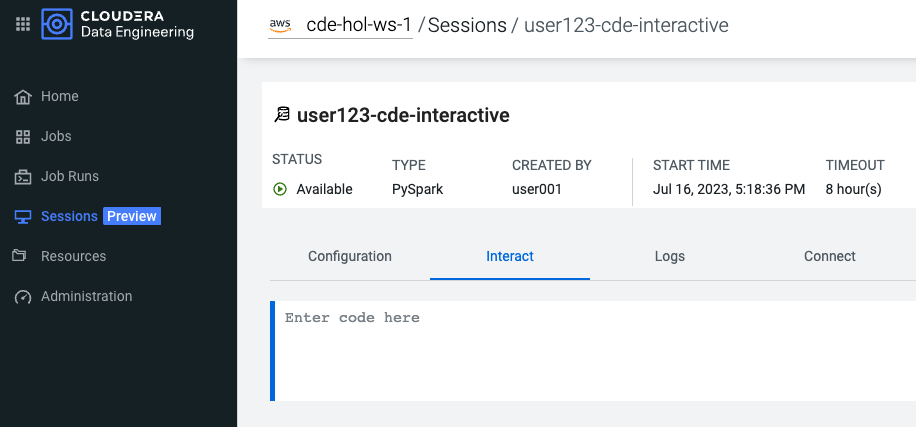<br>

3. As a first step, set your username variable for the commands to follow and verify that the shell is working as expected.

```python
USERNAME = spark._sc.sparkUser()
print(USERNAME)
```

### Verify the Data Quality Issues

With your Interactive Session running, you will now confirm the data quality issues in the sales table.

> **Infobox: Time Travel with Iceberg**
> * Recall the sales data is ingested in two batches, one for 2021, one for 2022.
> * Iceberg creates a new snapshot with every write operation (inserts, updates, deletes).
> * Note we're using the syntax `catalog.database.table.snapshots` to access the table history.

1. Verify the duplicates by comparing total counts to distinct counts for the fields "customer_id" and "VIN".

```python
sales_df = spark.sql(f"SELECT * FROM car_data_{username}.sales")
count_total = sales_df.count()
count_distinct = sales_df.select("customer_id", "VIN").distinct().count()
print(f"Total count: {count_total} vs. unique [customer_id, VIN] count: {count_distinct}.")
```

2. Check the table history by inspecting the Iceberg snapshots. You should see two snapshots in the sales table.

```python
spark.sql(f"SELECT * FROM spark_catalog.car_data_{username}.sales.snapshots").show()
```

Expected output:
```
+--------------------+-------------------+-------------------+---------+--------------------+--------------------+
|        committed_at|        snapshot_id|          parent_id|operation|       manifest_list|             summary|
+--------------------+-------------------+-------------------+---------+--------------------+--------------------+
|2023-12-09 00:01:...|7356121065394951566|               null|   append|s3a://cde-hol-buk...|{spark.app.id -> ...|
|2023-12-09 00:01:...| 362831684775421239|7356121065394951566|   append|s3a://cde-hol-buk...|{spark.app.id -> ...|
+--------------------+-------------------+-------------------+---------+--------------------+--------------------+
```

3. Check if the duplicates were introduced by a specific batch. It turns out that the second batch insert introduced the duplicates.

```python
snapshot_ids = spark.sql(f"SELECT snapshot_id FROM spark_catalog.car_data_{username}.sales.snapshots").collect()
for snapshot_id in snapshot_ids:
    sales_df = spark.read.format("iceberg").option("snapshot-id", snapshot_id[0]).load(f"spark_catalog.car_data_{username}.sales")
    count_total = sales_df.count()
    count_distinct = sales_df.select("customer_id", "VIN").distinct().count()
    print(f"Snapshot {snapshot_id} total count: {count_total} vs. unique [customer_id, VIN] count: {count_distinct}")
```

Expected output:

```
Snapshot Row(snapshot_id=7356121065394951566) total count: 1874 vs. unique [customer_id, VIN] count: 1874
Snapshot Row(snapshot_id=362831684775421239) total count: 6819 vs. unique [customer_id, VIN] count: 6667
```

### Options for Reverting the Table to an Uncorrupted State

Thanks to Iceberg there are new and safer options to address this issue, depending on the business needs. Note that executing any of the below options is not required for the rest of the workshop to work as intended.

* **Option A**: If having access to the latest batch is not critical, you can revert the table to the state before the second batch insert. This is done in Iceberg using the Spark rollback procedure:

```python
first_snapshot = spark.sql(f"SELECT snapshot_id FROM spark_catalog.car_data_{username}.sales.snapshots").first()[0]
spark.sql(f"CALL spark_catalog.system.rollback_to_snapshot('car_data_{username}.sales', {first_snapshot})").show()
```

This would result in:

```
+--------------------+-------------------+
|previous_snapshot_id|current_snapshot_id|
+--------------------+-------------------+
|  362831684775421239|7356121065394951566|
+--------------------+-------------------+
```

* **Option B**: You can simply drop the duplicates using PySpark. Note that this will again create a new snapshot, so if this turns out to be the wrong approach you can always revert the table again.

```python
sales_df_cleaned = sales_df.dropDuplicates(["customer_id", "VIN"])
sales_df_cleaned.createOrReplaceTempView("sales_df_cleaned")
spark.sql(f"INSERT OVERWRITE car_data_{username}.sales SELECT * FROM sales_df_cleaned")
```

Would result in a new snapshot. Note the **overwrite** snapshot as a result of the INSERT OVERWRITE statement:

```
+--------------------+-------------------+-------------------+---------+--------------------+--------------------+
|        committed_at|        snapshot_id|          parent_id|operation|       manifest_list|             summary|
+--------------------+-------------------+-------------------+---------+--------------------+--------------------+
|2023-12-09 10:42:...|2653522877398178198|               null|   append|s3a://cde-hol-buk...|{spark.app.id -> ...|
|2023-12-09 10:42:...|2162976375477413462|2653522877398178198|   append|s3a://cde-hol-buk...|{spark.app.id -> ...|
|2023-12-09 11:23:...|1434134148231443461|2162976375477413462|overwrite|s3a://cde-hol-buk...|{spark.app.id -> ...|
+--------------------+-------------------+-------------------+---------+--------------------+--------------------+
```

## Lab 3. Orchestrate Data Pipelines in Airflow

### Overview

You have already created and executed Spark Jobs manually via the CDE UI. In this section, you will learn how to create Airflow Jobs to schedule, orchestrate and monitor the execution of data pipelines consisting of multiple Spark Jobs on CDE. You will also implement **Option B** for addressing the quality issues by connecting to a CDW Virtual Warehouse.

You will also learn about:
- Navigating the Airflow UI
- Code and No-Code approaches to defining Airflow Jobs
- Airflow Key Concepts including DAGs, Operators, Connections

### Create and Schedule an Airflow DAG with the Visual Editor

You can use the CDE Airflow Editor to build DAGs without writing code. This is a great option if your DAG consists of a long sequence of CDE Spark or CDW Hive jobs. In this section, you will build a simple pipeline to orchestrate the CDE Spark Jobs you created before.

1. From the CDE home page, click on "Build a Pipeline" under the "Airflow Pipelines" section. Name your pipeline e.g. "pipeline". After confirming with "Create" you are taken to the CDE Pipeline Editor.

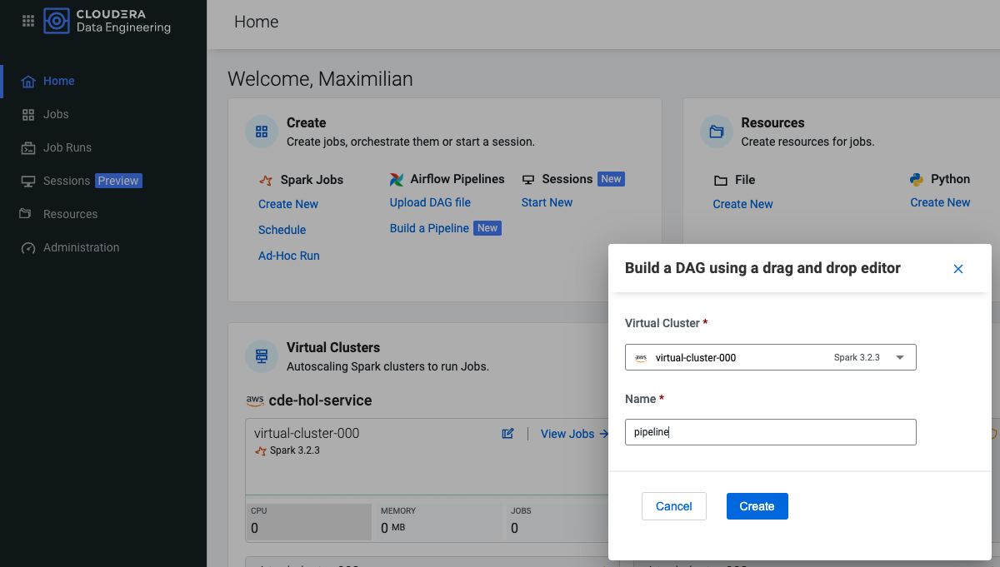<br>

2. To build your pipeline, simply drag and drop 3 CDE Spark Jobs onto the canvas and select the previously created "create", "ingest" and "validate" Spark Jobs.

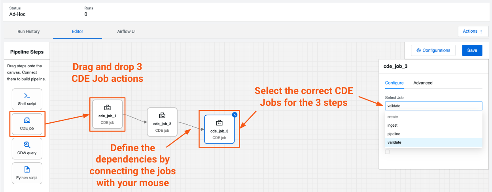<br>

3. Within the Visual Editor, configure the Airflow Job with the specs below to schedule it to run daily. Enable "catch_up" to allow the pipeline once after you save it. Close the configuration window again (your configs are saved automatically).

```
start_date: yesterday's date, e.g. 2024-06-12
end_date: some date in the future, e.g. 2024-06-30
schedule: @daily
catch_up: true
```

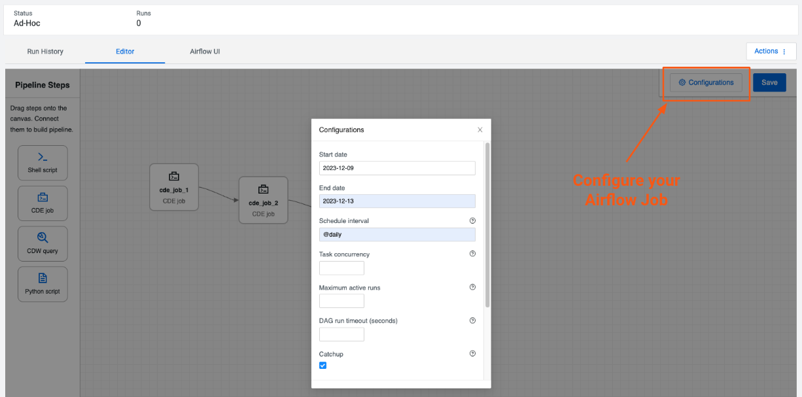<br>

4. Save your pipeline (!) to finally deploy it. Navigate back to the "Jobs Run" tab. Your pipeline should run and trigger the Spark Jobs **sequentially**.

### Navigate through the Airflow UI to Monitor your Pipeline

Now that the Airflow Job is busy sequentially running your Spark Jobs, explore how you can navigate the Airflow UI to manage and monitor your jobs.

1. From the "Jobs" tab, navigate to your newly created Airflow Job and click on "Airflow UI".

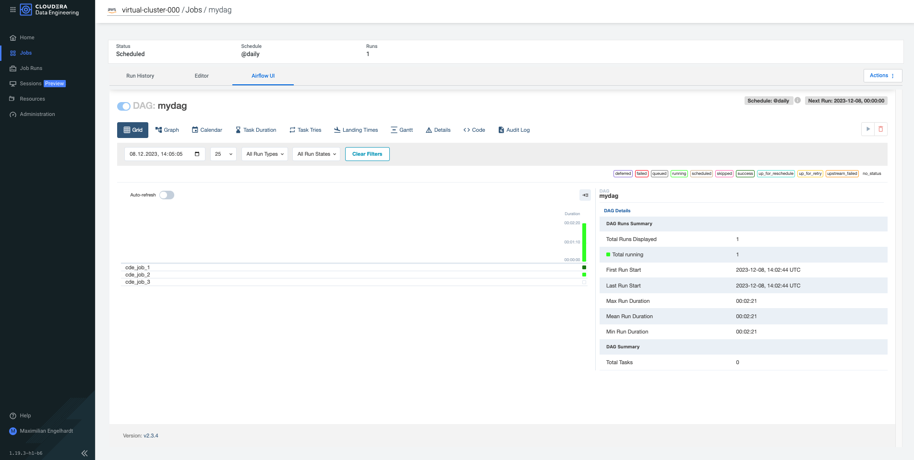<br>

2. In the Airflow UI, explore both the "Grid" (default) and the "Graph" view of your DAG. It should show the expected Jobs with 2 in "success" and 1 in "failed" status.

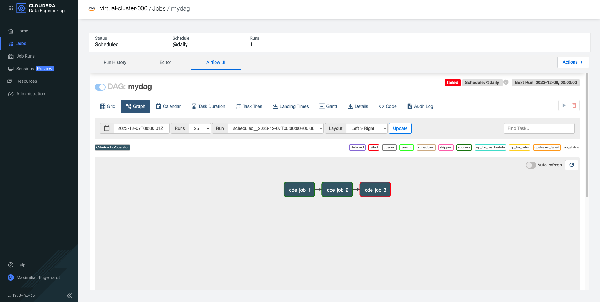<br>

> **Infobox: More complex Airflow Jobs and Python code**
> * In the Airflow UI, navigate to the "Code" and inspect the code file that was automatically generated when you created the pipeline.
> * As mentioned above, defining your pipeline using the (visual) Pipeline Editor is great for simple use cases, but you can always switch to defining your pipeline in Python code for more complex use cases.
> * On top of that, Airflow offers hundreds of open-source modules for interacting with different systems!

```python
...

dag = DAG(                      # <-- DAG configurations are defined here!
    dag_id='mydag',
    start_date=parser.isoparse('2023-12-07').replace(tzinfo=timezone.utc),
    end_date=parser.isoparse('2023-12-13').replace(tzinfo=timezone.utc),
    schedule_interval='@daily',
    catchup=True,
    is_paused_upon_creation=False,
    default_args={
        'owner': 'mengelhardt',
    },
)

cde_job_1 = CDEJobRunOperator(  # <-- this defines a CDE Spark Job!
    job_name='create',
    task_id='cde_job_1',
    dag=dag,
)

...

cde_job_2 << [cde_job_1]        # <-- dependencies between jobs are defined here!
cde_job_3 << [cde_job_2]
```

### Add a CDWOperator to the Pipeline to Address Data Quality Issues

Following the approach described in **Option B** in the previous section [Address Data Quality with Iceberg](#options-for-reverting-the-table-to-an-uncorrupted-state), you will leverage the CDWOperator to implement the "INSERT OVERWRITE" query directly from your Airflow Job.

This additional step just before the "validate" job should allow the complete pipeline to finish successfully!

> **Infobox: Submit CDW queries from CDE Airflow Jobs**
> * You can leverage CDE Airflow not only to orchestrate CDE internal Jobs, but any jobs running on CDP (and beyond).
> * The pre-built Cloudera-supported Operators for CDE and CDW are also published here: https://github.com/cloudera/cloudera-airflow-plugins

0. Create a Workload Password for your CDP User.

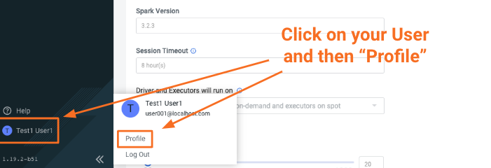<br>
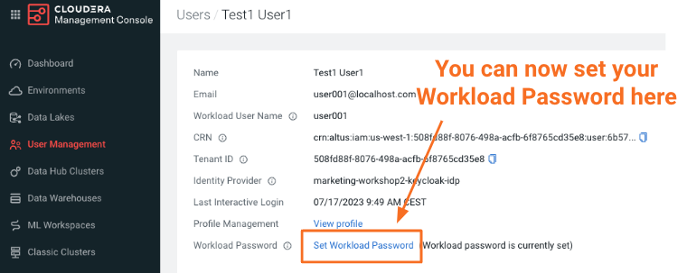<br>

1. Add an Airflow Connection to securely connect from CDE to a CDW Virtual Warehouse. From the CDE home page, click on the Virtual Cluster Details for your virtual cluster. From there, navigate to the Airflow UI.

<br>

2. In the Airflow UI, navigate to the "Admin" -> "Connection" section. Click the plus sign to add a new Airflow Connection, and then fill in the fields:

<br>

```
Conn Id: Connection name, e.g. "cdw-virtual-warehouse".
Conn Type: Select "Hive Client Wrapper".
Host: hs2-cde-hol-vw.dw-cde-hol-dtag-cdp-env.yu1t-vbzg.cloudera.site
Login: <username>
Password: <workload-password>
```

3. After the Connection is created, navigate back to your Airflow Job and open the Editor. Add a CDW query by dragging it onto the canvas. Edit the query below with your username and paste it into the CDW query.

```sql
-- overwrite the sales table
-- with unique records only
INSERT OVERWRITE
TABLE car_data_<username>.sales
SELECT DISTINCT *
FROM car_data_<username>.sales
```

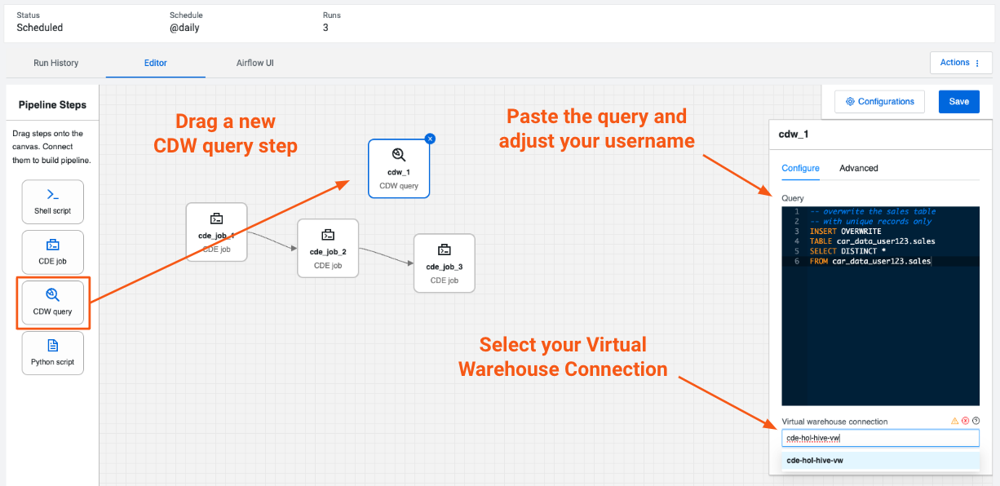<br>

4. Edit the dependencies between your jobs to make sure the jobs are executed in the following order:

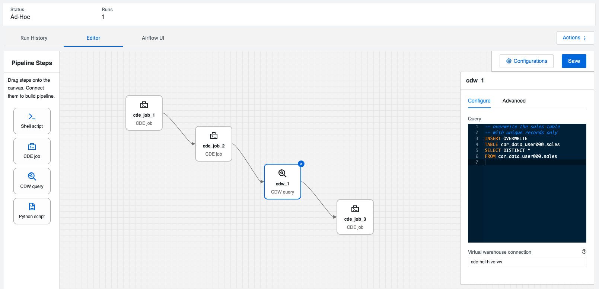<br>

5. Save the pipeline to make the changes effective. Next, return to the "Jobs" tab and run the pipeline manually. After a while, you should see the pipeline has finished successfully this time!

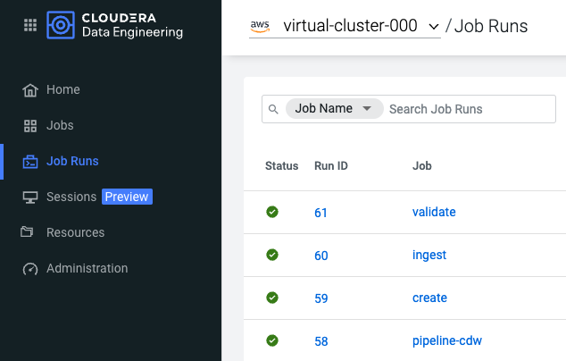<br>

## Lab 4. Automate Workflows with the CDE CLI

### Overview

You've seen how to manage both Spark and Airflow Jobs using the CDE UI, what's left to do? Leverage the CDE CLI to automate your workflows, e.g. to enable CI/CD.

### Configure and run the CDE CLI using Docker (recommended)

1. Retrieve your Virtual Jobs API URL by clicking on the "Cluster Details" icon of your Virtual Cluster.

<br>

2. Update the file "cde_cli/config/config.yaml" with your Virtual Cluster JOBS API and your username.

```
user: <username>
vcluster-endpoint: <jobs-api-url>
auth-pass-file: /home/cdeuser/.cde/creds.txt  <-- leave this as configured
```

3. Update the file "cde_cli/config/creds.txt" with the Workload password you set previously (you can always set a new one as well).

```
<workload-password>
```

4. Run the CDE CLI without further setup. Note that the "cde_cli/config" directory is mounted from your host into the container.

```bash
bash ./cde_cli/run.sh
```

Should give you a bash terminal in the CDE CLI container. Running the below should list all of your CDE Spark and Airflow Jobs!

```
cdeuser@8c2b6432370d:~$ cde job list
```

### Alternatively: Set up the CDE CLI manually (not recommended)

If you do not have Docker installed, you may download and set up the CDE CLI binary directly by following the instructions provided in the [official documentation](https://docs.cloudera.com/data-engineering/cloud/cli-access/topics/cde-cli.html). Note that the configuration steps may differ slightly from the Docker setup based on your environment.

### Execute your Airflow Job from the CDE CLI

1. Run the Airflow Job from the CLI. Note that this will trigger the entire pipeline to run again. The response will be the Run ID for the Job Run.

```bash
cdeuser@4b2fb5fe2cc5:~$ cde job run --name "pipeline"

{
  "id": 32
}
```

2. Verify from the CDE and Airflow UIs that the pipeline is running as expected.

> **Infobox: Leveraging the CDE CLI**
> * The CDE CLI allows you to manage the full life cycle of your applications on CDE.
> * For some examples, please refer to the [CDE CLI Demo](https://github.com/pdefusco/CDE_CLI_demo), a more advanced CDE CLI reference with additional details for the CDE user who wants to move beyond the basics.

# Next Steps

CDE is the Cloudera Data Engineering Service, a containerized managed service for Spark and Airflow.

If you are exploring CDE you may find the following tutorials relevant:

* [Spark 3 & Iceberg](https://github.com/pdefusco/Spark3_Iceberg_CML): A quick intro of Time Travel Capabilities with Spark 3.

* [Simple Intro to the CDE CLI](https://github.com/pdefusco/CDE_CLI_Simple): An introduction to the CDE CLI for the CDE beginner.

* [CDE CLI Demo](https://github.com/pdefusco/CDE_CLI_demo): A more advanced CDE CLI reference with additional details for the CDE user who wants to move beyond the basics.

* [CDE Resource 2 ADLS](https://github.com/pdefusco/CDEResource2ADLS): An example integration between ADLS and CDE Resource. This pattern is applicable to AWS S3 as well and can be used to pass execution scripts, dependencies, and virtually any file from CDE to 3rd party systems and vice versa.

* [Using CDE Airflow](https://github.com/pdefusco/Using_CDE_Airflow): A guide to Airflow in CDE including examples to integrate with 3rd party systems via Airflow Operators such as BashOperator, HttpOperator, PythonOperator, and more.

* [GitLab2CDE](https://github.com/pdefusco/Gitlab2CDE): a CI/CD pipeline to orchestrate Cross-Cluster Workflows for Hybrid/Multicloud Data Engineering.

* [CML2CDE](https://github.com/pdefusco/cml2cde_api_example): an API to create and orchestrate CDE Jobs from any Python based environment including CML. Relevant for ML Ops or any Python Users who want to leverage the power of Spark in CDE via Python requests.

* [Postman2CDE](https://github.com/pdefusco/Postman2CDE): An example of the Postman API to bootstrap CDE Services with the CDE API.

* [Oozie2CDEAirflow API](https://github.com/pdefusco/Oozie2CDE_Migration): An API to programmatically convert Oozie workflows and dependencies into CDE Airflow and CDE Jobs. This API is designed to easily migrate from Oozie to CDE Airflow and not just Open Source Airflow.

For more information on the Cloudera Data Platform and its form factors please visit [this site](https://docs.cloudera.com/).

For more information on migrating Spark Jobs to CDE, please reference [this guide](https://docs.cloudera.com/cdp-private-cloud-upgrade/latest/cdppvc-data-migration-spark/topics/cdp-migration-spark-cdp-cde.html).

If you have any questions about CML or would like to see a demo, please reach out to your Cloudera Account Team or send a message [through this portal](https://www.cloudera.com/contact-sales.html) and we will be in contact with you soon.


